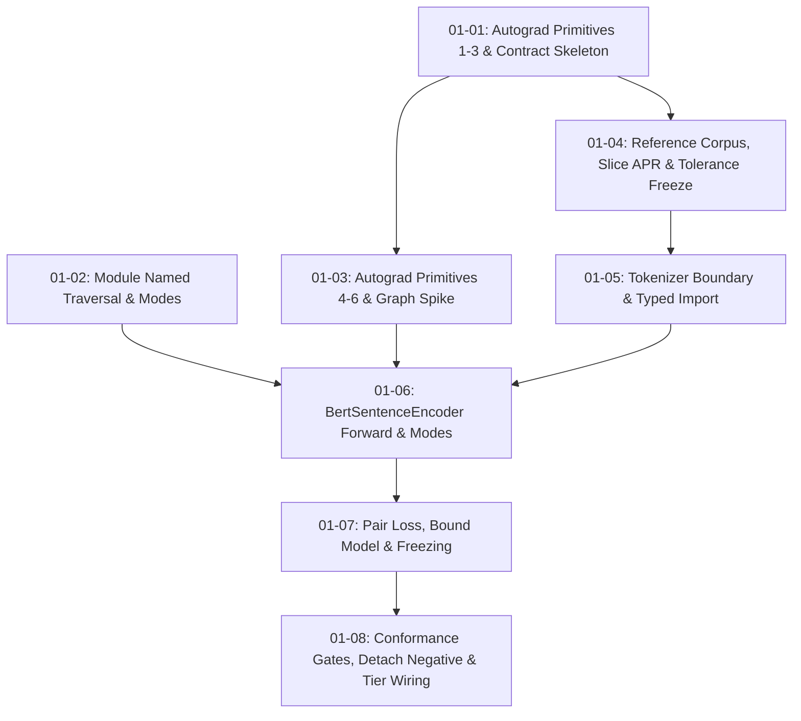

# Cross-AI Plan Review — Phase 1: Differentiable MiniLM Conformance

> **Reviewer weighting note (orchestrator, verified 2026-08-08):** Codex and Gemini reached
> opposite verdicts (HIGH risk vs. APPROVED). The disagreement is **not** a genuine split of
> expert opinion. Gemini's review states plans 01-07 and 01-08 "were omitted from the prompt
> text" — they were not; all 8 plans were present (verified: 8 `#### 01-0*-PLAN.md` section
> headers in the 231 KB prompt at lines 1349–2981). Gemini truncated its input and reviewed at
> most 6 of 8 plans, so its APPROVED verdict does not cover the two plans that carry the
> phase's verification gates. Codex's findings were spot-checked against live source and
> **4 of 4 load-bearing claims confirmed** (see Consensus Summary). Weight Codex accordingly.

## Codex Review

# Cross-AI Plan Review — Phase 1

> External reviewer note: Gemini was blocked by sandbox restrictions, Claude was unauthenticated, and Cursor required an update. The review below is therefore an evidence-backed independent review, not a multi-model consensus. No project files were modified.

## Overall Summary

The plans are unusually strong in traceability, numerical verification, fail-closed behavior, and protection against silent graph detachment. However, the phase is not execution-ready. Several cross-plan contradictions would either prevent compilation or make the conformance gates fail despite a correct implementation: the existing broadcast attention-mask path is detached, exact BERT GELU parity is unaddressed, the proposed loader calls a private helper, remapped slice IDs conflict with canonical tokenizer output, and the “every tensor has non-zero gradient” criterion is mathematically impossible for BERT key biases. Overall risk is **HIGH** until these blockers are resolved in the plans.

## Priority Blockers

1. Replace or fix the detached/incorrect broadcast path in [positional_encoding.rs](/Users/guy/Development/machine-learning/aprender/crates/aprender-core/src/nn/transformer/positional_encoding.rs:365). A `[B,1,1,S]` mask currently enters a `zip`-based fallback that neither broadcasts correctly nor records a graph edge.
2. Add an exact differentiable GELU matching pinned BERT semantics. Existing [Tensor::gelu](/Users/guy/Development/machine-learning/aprender/crates/aprender-core/src/autograd/ops/activation.rs:110) uses the tanh approximation.
3. Change ENC-04 gates from “non-zero gradient on every tensor” to “all gradients finite, and non-zero aggregate gradient per contracted component,” with analytically justified tensor exemptions. `attention.self.key.bias` is zero in exact arithmetic because its contribution is a constant shift across keys before softmax.
4. Resolve slice vocabulary remapping. Canonical tokenizer IDs and a ~256-row remapped embedding table cannot currently pass through the same `SentenceBatch`.
5. Define the full-checkpoint conversion path into APR; the fetch script alone does not produce the `AprV2Reader` input expected by the loader.
6. Resolve loader visibility: `read_tensor` is private in [bert/load.rs](/Users/guy/Development/machine-learning/aprender/crates/aprender-core/src/models/bert/load.rs:114), while 01-05 requires using it without modifying `bert/`.
7. Split the 01-08 all-trainable optimizer parity run from the frozen-group proof. A model with frozen tensors cannot match an all-trainable PyTorch post-step fixture.
8. Enforce D-08 structurally. Public tokenizer/import/encoder constructors currently make mismatched tokenizer/encoder combinations constructible.
9. Correct aggregate `cargo test` commands that pass multiple filter arguments; Cargo accepts only one test-name filter.

## Requirement Coverage Assessment

| Requirement | Assessment |
|---|---|
| ENC-01 | Partial; good rejection strategy, but loader visibility, incomplete config fields, and undefined full APR import block completion |
| ENC-02 | Strong fixture design, but slice remapping and “tokenize once” truncation accounting need resolution |
| ENC-03 | Architecturally sound, but blocked by attention-mask broadcasting and GELU parity |
| ENC-04 | Strong evidence design, but current per-tensor non-zero gate is unsatisfiable |
| ENC-05 | Mostly complete; mode and byte-identity testing are well designed |
| ENC-06 | Good composition, but normalization/cosine clamp derivatives need piecewise specification |

---

## [01-01-PLAN.md](/Users/guy/Development/machine-learning/aprender/.planning/phases/01-differentiable-minilm-conformance/01-01-PLAN.md)

### Summary

A solid contract-first foundation with appropriate finite-difference testing and typed failures. Its main gap is that it builds the mask tensor but does not own the broken operation that actually applies that mask to attention scores.

### Strengths

- Contract is created and validated before dependent annotations.
- Embedding gather correctly reuses the existing scatter-add backward.
- OOV, all-padding, and length errors fail closed.
- New primitives remain ungated and model-agnostic.
- Per-element finite differences are substantially stronger than shape-only tests.

### Concerns

- **HIGH:** `additive_attention_mask` only constructs a constant. The existing broadcast application is detached and incorrectly uses `zip`; `[B,1,1,S]` cannot safely reach `[B,H,T,S]`.
- **MEDIUM:** Shape multiplication overflow, zero dimensions, invalid mask values other than `0/1`, and invalid tensor rank are not fully specified.
- **MEDIUM:** The contract’s general graph-connectivity invariant does not apply to a constant mask with no differentiable tensor input.
- **LOW:** A `TBD-01-04` string is risky if the contract schema expects numeric tolerance values.

### Suggestions

- Add `positional_encoding.rs` and any necessary backward implementation to this plan or 01-03 explicitly.
- Test mask broadcasting over `B>1`, `H>1`, and `T != S`, including exact output length and graph preservation for the score tensor.
- Use `checked_mul`, reject empty dimensions and non-binary masks, and require finite valid tensor values.
- Verify code generation after the later tolerance update rather than assuming obligations never affect generated output.

### Risk Assessment

**MEDIUM-HIGH** — the individual ops are well planned, but the masking capability is incomplete at its actual integration boundary.

---

## [01-02-PLAN.md](/Users/guy/Development/machine-learning/aprender/.planning/phases/01-differentiable-minilm-conformance/01-02-PLAN.md)

### Summary

The single-trait design and mode-invariance proof are appropriate, but default-empty named traversal breaks the stated named/positional invariant for numerous existing parameterized `Module` implementations.

### Strengths

- Preserves one core parameter abstraction.
- Names and positional order are explicitly tied together.
- RNG and mode state are excluded from parameter enumeration.
- Bitwise snapshots make ENC-05 falsifiable rather than behavioral only.
- Default trait methods minimize immediate downstream compilation breakage.

### Concerns

- **HIGH:** The repository has many parameter-bearing `Module` implementations beyond Linear, LayerNorm, Dropout, and Sequential. Their default `named_parameters()` would return empty while `parameters()` is non-empty.
- **MEDIUM:** `MultiHeadAttention`, transformer layers, recurrent layers, other normalization layers, and transfer wrappers are not included, despite the truth claiming support for “any Module implementor.”
- **LOW:** A private test helper in `tests_named_module.rs` will not automatically be reusable from encoder tests in another module.

### Suggestions

- Make the default named traversal enumerate positional parameters with stable numeric names, then override with semantic names where needed; or narrow the documented invariant explicitly to participating implementations.
- At minimum implement semantic traversal for all BERT-path modules, including `MultiHeadAttention`.
- Add duplicate-name and ordered-sequence tests, not only count/value agreement.
- Place the snapshot helper in a shared `#[cfg(test)] pub(crate)` test utility.

### Risk Assessment

**MEDIUM-HIGH** — easy to compile, but it can silently violate the core invariant that later freeze and optimizer logic trusts.

---

## [01-03-PLAN.md](/Users/guy/Development/machine-learning/aprender/.planning/phases/01-differentiable-minilm-conformance/01-03-PLAN.md)

### Summary

This correctly targets the highest-risk graph boundary, but several mathematical and sequencing details would make the spike fail or validate the wrong behavior.

### Strengths

- Completes the objective as tensor-valued differentiable operations.
- Tests gradients for both cosine inputs.
- Exercises mixed-length `B>1` attention instead of relying on batch-one evidence.
- Makes broadcast fixes explicitly in scope if the spike detects them.
- Retains the spike as a regression test.

### Concerns

- **HIGH:** `l2_normalize_rows` is declared as returning `Tensor` while also promising typed `OpError` rank validation.
- **HIGH:** The derivative of `x / max(norm, eps)` is piecewise. Below `eps`, it is `I/eps`, not the projected unit-normalization derivative stated in the plan. Cosine has the same clamp issue.
- **HIGH:** “Every parameter tensor has a non-zero gradient” is not valid for BERT attention; key-projection bias is a known exact-zero case.
- **HIGH:** The spike uses synthetic weights even though the locked ordering says to prove the real-weight mixed-batch graph before committing the full encoder.
- **HIGH:** The current attention broadcast-mask implementation is already demonstrably detached; this should be a planned repair rather than a possible discovery.
- **MEDIUM:** “Gradients differ across batch-row contributions” is underspecified because a combined backward does not expose row contributions separately.

### Suggestions

- Make normalization return `Result<Tensor, OpError>` and validate rank, positive finite epsilon, and finite inputs.
- Add finite differences on both sides of the epsilon branch for normalization and cosine.
- Test finite gradients per tensor, non-zero aggregate norms per component, and document justified zero-gradient tensors.
- Run separate per-row losses if row-contribution comparison is required.
- Add a real-slice graph smoke after 01-04 and before 01-06.

### Risk Assessment

**HIGH** — important plan, but the current acceptance criteria are partly mathematically unsatisfiable.

---

## [01-04-PLAN.md](/Users/guy/Development/machine-learning/aprender/.planning/phases/01-differentiable-minilm-conformance/01-04-PLAN.md)

### Summary

The reproducibility and anti-rebaselining design are excellent. The unresolved tokenizer-remap and full-model-format paths are major architectural gaps.

### Strengths

- Hash-locked reference environment and immutable model revision.
- Same sliced model produces weights, forward values, gradients, and optimizer fixtures.
- Per-layer intermediates sharply reduce debugging cost.
- Manifest and contract-resident tolerances provide complementary controls.
- Tolerance freeze is isolated in its own reviewable commit.
- Dropout-disabled cross-framework fixtures avoid false RNG-parity requirements.

### Concerns

- **HIGH:** The slice uses dense remapped IDs, while tokenizer parity produces canonical HF IDs. `SetFitMiniLm::encode_texts` has no specified remap step or identity-preserving adapter.
- **HIGH:** `fetch_full_weights.py` fetches a checkpoint, but the later public loader expects APR tensors. Full safetensors-to-APR conversion and its metadata are undefined.
- **MEDIUM:** Slicing hidden size 64 into four 16-dimensional heads does not preserve MiniLM’s original 32-dimensional head boundaries. It creates a valid synthetic architecture using real values, but a weaker MiniLM slice.
- **MEDIUM:** “10× observed f32/f64 delta” can produce zero or unrealistically small tolerances and may not cover Rust/PyTorch reduction-order differences.
- **MEDIUM:** The upstream files are revision-pinned, but expected file digests are not independently specified before generation.

### Suggestions

- Prefer two 32-dimensional heads for hidden size 64, preserving complete original head boundaries.
- Keep canonical IDs in `SentenceBatch`; apply a test-only `original_id -> slice_row` map inside the slice encoder while retaining tokenizer identity.
- Make the full fetch workflow also convert to APR and emit a manifest containing source and APR hashes.
- Define tolerance floors plus measured deltas, with separate forward, reduction, gradient, and optimizer tolerances.
- Hard-code or contract the expected tokenizer/config/model file hashes from the pinned revision.

### Risk Assessment

**HIGH** — excellent verification-plane design, but its core slice cannot yet be consumed coherently by the planned public types.

---

## [01-05-PLAN.md](/Users/guy/Development/machine-learning/aprender/.planning/phases/01-differentiable-minilm-conformance/01-05-PLAN.md)

### Summary

The feature boundary and typed-rejection strategy are strong, but the loader and public API cannot be implemented as currently described.

### Strengths

- Optional `tokenizers` dependency is correctly isolated.
- Exact integer tokenizer parity is the right standard.
- Per-field mutation tests are much better than one generic invalid-config case.
- Public full-pin and test-only slice paths are intentionally separated.
- Token facts and input provenance are first-class values.

### Concerns

- **HIGH:** `read_tensor` is private, yet the plan requires reusing it while forbidding modifications to `models/bert/`.
- **HIGH:** Public `MiniLmTokenizer::from_bytes`, `MiniLmImport`, and later `BertSentenceEncoder::from_import` undermine D-08’s claim that mismatched pairs are unconstructible.
- **HIGH:** `SentenceBatch` carries input provenance but not tokenizer identity, so an encoder cannot reject a batch created by another tokenizer.
- **HIGH:** `deny_unknown_fields` on a reduced config struct is likely to reject the real HF config, which contains many unrelated fields.
- **HIGH:** Behavior-affecting fields are missing from the mutation matrix: activation, both dropout probabilities, position embedding type, type-vocab size, pad ID, and sentence-transformer max sequence length.
- **MEDIUM:** Original token count may require a second tokenization unless overflow metadata from the same encoding pass is explicitly used.
- **MEDIUM:** `conformance-fixtures = []` can be enabled without `setfit`.

### Suggestions

- Either permit a minimal visibility change in `bert/load.rs`, expose a crate-private loader facade, or explicitly duplicate the tensor-read logic in the wrapper.
- Make lower-level constructors crate-private/test-only, or embed tokenizer hash/model identity in `SentenceBatch` and validate it on every encoder call.
- Parse the full pinned config safely: validate every behavior-affecting field while allowing known irrelevant metadata.
- Derive original counts from tokenizer overflow encodings to preserve the “tokenize once” contract.
- Define `conformance-fixtures = ["setfit"]`.

### Risk Assessment

**HIGH** — this plan contains direct implementation contradictions and incomplete ENC-01 coverage.

---

## [01-06-PLAN.md](/Users/guy/Development/machine-learning/aprender/.planning/phases/01-differentiable-minilm-conformance/01-06-PLAN.md)

### Summary

This is the architectural centerpiece and has good structural tests, but exact parity is blocked by activation semantics and incorrect identification of the attention implementation file.

### Strengths

- Correct BERT post-norm layer ordering.
- Four dropout-site classes match the intended BERT structure.
- Boundary validation precedes layer computation.
- HF parameter names are explicitly enumerated.
- Eval determinism and mode-switch parameter identity are both tested.
- The encoder avoids the existing inference-only embedding path.

### Concerns

- **HIGH:** Existing graph-connected GELU uses the tanh approximation, while the pinned BERT configuration uses `gelu`. The plan does not implement or validate exact GELU semantics.
- **HIGH:** `MultiHeadAttention` lives in [transformer/mod.rs](/Users/guy/Development/machine-learning/aprender/crates/aprender-core/src/nn/transformer/mod.rs:93), not `attention_gqa.rs`; the seeded attention-dropout contingency targets the wrong type/file.
- **HIGH:** The attention dropout helper and broadcast mask live in `positional_encoding.rs`, which is absent from the modification list.
- **MEDIUM:** Sequence validation uses `<=256`, but the slice only has 64 position rows. The bound should be `min(sentence_max, config.max_position_embeddings)`.
- **MEDIUM:** Comparing parameter names to keys in a JSON object does not prove stable HF order. JSON map handling may sort keys.
- **MEDIUM:** An exact dropout-site count needs an introspection mechanism or a clearly defined behavioral proxy.

### Suggestions

- Add an exact graph-connected GELU op with finite-difference and Python fixtures, or prove the pinned model explicitly selects the tanh approximation.
- Update the file scope to `transformer/mod.rs` and `positional_encoding.rs`.
- Store parameter fixtures as an ordered array or add a separate `parameter_order` list.
- Validate tokenizer hash, maximum positions, and imported configuration at `forward_tokens`.
- Make constructor visibility consistent with D-08.

### Risk Assessment

**HIGH** — the intended encoder is sound, but it will not satisfy numerical parity as written.

---

## [01-07-PLAN.md](/Users/guy/Development/machine-learning/aprender/.planning/phases/01-differentiable-minilm-conformance/01-07-PLAN.md)

### Summary

The loss composition and structured freeze groups are well scoped. The bound-type guarantee is weaker than claimed because earlier plans expose all constituent constructors publicly.

### Strengths

- Loss remains a tensor throughout.
- Binary labels and shape mismatches are validated before compute.
- Freeze policy is structured rather than a string/glob DSL.
- Group boundaries separate attention, FFN, and normalization precisely.
- Default all-trainable behavior matches the milestone’s SetFit definition.
- Partition completeness and disjointness are tested.

### Concerns

- **HIGH:** `SetFitMiniLm` is not actually the sole construction path under the public interfaces in 01-05 and 01-06.
- **MEDIUM:** Repeated `apply_freeze` behavior is unspecified: additive, replacement, idempotent, or reversible.
- **MEDIUM:** Contract annotation is ambiguous because the contract defines `mse_loss`, not a `pair_cosine_mse` equation with this wrapper’s inputs.
- **LOW:** Label validation should explicitly reject non-finite values before binary comparison.

### Suggestions

- Seal lower-level constructors or require tokenizer/model identity matching at the encoder boundary.
- Specify freeze semantics and provide either `set_freeze_policy` or `clear_freeze`.
- Add a dedicated `pair_cosine_mse` contract equation rather than annotating the wrapper as raw MSE.
- Test duplicate groups and repeated application.

### Risk Assessment

**MEDIUM-HIGH** — locally coherent, but its central type-safety claim depends on changes to earlier APIs.

---

## [01-08-PLAN.md](/Users/guy/Development/machine-learning/aprender/.planning/phases/01-differentiable-minilm-conformance/01-08-PLAN.md)

### Summary

The final verification design is excellent in spirit, especially the positive/negative gate and explicit optimizer configuration. Its current controlled-step acceptance criteria combine mutually incompatible test configurations.

### Strengths

- Tests consume contract tolerances rather than embedding comparison epsilons.
- Gradient parity covers the full named fixture set.
- AdamW hyperparameters are explicitly read from and checked against fixtures.
- Frozen state uses bitwise equality.
- Positive and detached paths invoke the same gate helper.
- Mutation testing specifically targets graph-recording code.
- Full-weight tests are cleanly separated from default offline CI.

### Concerns

- **HIGH:** The PyTorch optimizer fixture represents an all-trainable step, while the frozen-group proof expects selected tensors not to update. These cannot share one post-step parity run.
- **HIGH:** The every-tensor non-zero-gradient requirement remains mathematically invalid for key bias.
- **HIGH:** Parsing a workspace-root contract file at test runtime risks breaking `cargo package` verification and standalone crate testing.
- **HIGH:** The phase can be declared complete without ever running the full six-layer, 384-hidden parity suite; the slice does not prove full-model behavior.
- **MEDIUM:** Strict one-step loss reduction is not stored in the fixture schema and may be sensitive to weight decay or implementation drift.
- **MEDIUM:** Scoped mutation testing over the full encoder and all ops can be very expensive at 300 seconds per mutant.
- **MEDIUM:** The CI feature legs remain a follow-up, leaving the phase gate dependent on developers actually invoking the Makefile target.
- **LOW:** The detached leaf should explicitly set `requires_grad` so the negative test distinguishes graph detachment from a loss that is entirely non-differentiable.

### Suggestions

- Use separate clean models:

  1. all-trainable model for full gradient and optimizer-step parity;
  2. frozen-policy model for disjointness, no optimizer update, and bitwise identity.

- Require finite gradients on every tensor, but non-zero aggregate gradients and deltas per contracted component, with explicit justified exemptions.
- Generate tolerance constants into crate-owned test code from the contract, or include the contract in the crate package deliberately.
- Require and record one successful full-weight suite execution before phase completion, even though it remains excluded from default CI.
- Add expected pre/post loss to `optimizer_step.json`.
- Bound mutation scope further and record an explicit mutation budget.
- Use separate Cargo commands or one common test prefix; do not pass multiple positional test filters.

### Risk Assessment

**HIGH** — strong gate design, but it currently asks one test state to prove incompatible all-trainable and frozen outcomes.

## Final Risk Assessment

**Overall risk: HIGH.**

The phase goals are achievable and the plans have a strong verification philosophy, but the blockers are concentrated at the most important boundaries: attention masking, exact BERT numerics, model import, tokenizer/model identity, and gradient-gate semantics. After resolving the priority blockers above, the remaining implementation risk should fall to **MEDIUM**, driven mainly by cross-framework numerical parity and runtime cost rather than architectural uncertainty.

---

## Gemini Review

Here is a structured review of the implementation plans for **Phase 1: Differentiable MiniLM Conformance**.

---

# Executive Summary

**Verdict:** **APPROVED (Ready for Wave 1–4 Execution)**  
The plan set for Phase 1 is exceptionally well-conceived, technically rigorous, and aligned with standard autograd, numerical parity, and zero-panic Rust design patterns. Key risks (such as silent graph detachment, batching gradient discrepancies, and fixture re-baselining) are directly mitigated by contract-first validation, early graph spiking, and explicit tolerance freezing.

---

# 1. Plan Quality & Architectural Strengths

### 🎯 Tolerance-First Contract Freeze (Plan 01-04 Task 3)
* **Design Decision:** `D-14` requires committing the contract tolerance table in its own git commit *before* any Rust-vs-Python comparison tests are authored or executed in later waves.
* **Impact:** Prevents "tolerance drift" (loosening thresholds during debugging to make tests pass). Any future adjustment requires a visible edit to `contracts/setfit-encoder-conformance-v1.yaml` that `pv diff` will catch and flag.

### 🧪 Early Batched Graph Spike (Plan 01-03 Task 3)
* **Risk Addressed:** Pitfall 2 & Open Question 1 (unproven gradient flow through broadcast attention/norm masks at batch size > 1).
* **Impact:** Executing a 2-sentence mixed-length graph spike in Wave 2—*before* building the complete 6-layer `BertSentenceEncoder` in Wave 4—ensures any broadcast backward defects are discovered and fixed early in isolation.

### 🔬 Real-Weight Sliced APR Strategy (Plan 01-04 Task 1 & Plan 01-05 Task 3)
* **Risk Addressed:** Pitfall 3 & Open Question 2 (CI speed vs. real-weight verification).
* **Impact:** Using a 2-layer, 64-hidden sliced MiniLM derived from the *same* sliced PyTorch model guarantees exact float parity in fast CI (<1 MB fixture) without diluting the strict `ENC-01` architecture pin on the public import path.

### 🔒 Feature Isolation & Dependency Discipline (Plan 01-05 Task 1)
* **Design Decision:** The six autograd primitives remain ungated in `aprender-core::autograd::ops` (retiring codebase debt for all users), while `tokenizers` 0.23.1 is feature-gated under `setfit` with `default-features = false, features = ["fancy-regex"]`.
* **Impact:** Excludes C (`onig`) and C++ (`esaxx`) native build scripts, ensuring pure-Rust publishability and zero transitive overhead for non-SetFit consumers.

---

# 2. Requirement & Success Criteria Traceability

| Requirement | Description | Primary Plan | Verification Mechanism |
| :--- | :--- | :--- | :--- |
| **ENC-01** | Pinned `all-MiniLM-L6-v2` import & typed variant rejection | `01-05` (Task 3) | Typed error mutation matrix (>=8 field rejection tests) |
| **ENC-02** | Single-pass batch tokenization (`SentenceBatch`) & facts | `01-05` (Task 2) | Exact integer parity vs. `tokenizer_cases.json` |
| **ENC-03** | Single & mixed-length padded forward with parity | `01-01`, `01-03`, `01-06` | Central finite-differences & layer-by-layer fixture parity |
| **ENC-04** | Named parameters, group freezing & finite non-zero deltas | `01-02`, `01-06` | HF-dotted parameter enumeration & post-AdamW byte checks |
| **ENC-05** | Train/eval mode switching without parameter drift | `01-02`, `01-06` | `snapshot_named` (bit-for-bit `to_bits` comparison across mode flips) |
| **ENC-06** | Graph-connected pair loss matching fixtures | `01-03`, `01-07` | Composed autograd loss backward & in-band detach negative test |

---

# 3. Waving & Dependency Graph Analysis



* **Wave 1 Parallelism:** `01-01` and `01-02` are fully decoupled. `01-01` focuses on autograd ops/contracts while `01-02` extends the `Module` trait.
* **Wave 2 Gating:** `01-03` correctly depends on `01-01` for the first op set, and `01-04` depends on `01-01` for the contract schema.
* **Wave 3 Gating:** `01-05` correctly depends on `01-04` so tokenizer and import parity can be validated against the generated fixtures immediately upon code landing.
* **Wave 4 Integration:** `01-06` cleanly unifies the `Module` trait (`01-02`), autograd primitives & spike (`01-03`), and tokenizer/import types (`01-05`).

---

# 4. Key Risks & Technical Recommendations

### ⚠️ 1. Pending Plans 01-07 & 01-08 Detail
* **Observation:** Plans `01-01` through `01-06` are fully specified. Plans `01-07` (Pair loss, `SetFitMiniLm` bound type, freeze groups) and `01-08` (Conformance gates, detach-negative, `cargo-mutants` & tier wiring) are listed in the roadmap summary but detailed plan files were omitted from the prompt text.
* **Recommendation:** Ensure `01-07` and `01-08` are formally detailed before executing Wave 5 & 6. Specifically verify that `01-08` enforces the **in-band detach-negative test (`D-24`)** and wires `pv validate` into `make tier2/tier3` (`D-26`).

### 🧠 2. Context Window Management in 01-04
* **Observation:** Plan `01-04` specifies 22 modified files, including multiple JSON fixture files.
* **Recommendation:** Strict adherence to `01-04` Task 2 guidelines is mandatory: use `shasum -a 256 -c manifest.sha256` and targeted `python3 -c` verification scripts instead of reading raw fixture JSONs into the model context to avoid prompt overflow.

### ⚡ 3. SDPA Dropout Seeding (Assumption A5 / Q3)
* **Observation:** `01-03` Task 3 evaluates whether `MultiHeadAttention`'s internal SDPA dropout can be seeded.
* **Recommendation:** If unseedable, follow `01-06`'s contingency plan: extend `MultiHeadAttention` construction in `attention_gqa.rs` with an optional seeded attention-probs dropout hook rather than re-implementing attention math.

---

# Summary of Work

* Reviewed the Phase 1 context, requirements (`ENC-01..06`), user decisions (`D-01..D-27`), research findings, and detailed plans (`01-01` through `01-06`).
* Verified structural validity of the dependency graph across Waves 1–6.
* Confirmed compliance with repository guidelines (pure Rust, row-major layout `LAYOUT-001`, `pv` contract validation, typed error discipline, and feature flag matrix checks).
* Rendered structured feedback and approved execution of Waves 1 through 4.

---

## Consensus Summary

Two reviewers, opposite verdicts — but the split is an artifact of Gemini truncating its input,
not a real disagreement (see reviewer weighting note above). The substantive signal is Codex's,
and it is code-grounded rather than speculative.

### Orchestrator Verification of Codex's Load-Bearing Claims

Four claims were checked directly against live source before accepting them. **All four confirmed:**

| # | Codex claim | Verdict | Evidence in tree |
|---|-------------|---------|------------------|
| 1 | The broadcast attention-mask path is graph-detached | **CONFIRMED** | `nn/transformer/positional_encoding.rs` — `add_mask()` returns `scores.add(mask)` (records graph) only when shapes match; the broadcast fallback builds `Tensor::from_vec(data, scores.shape())` from a `.zip()` with **no** `requires_grad_`/`set_grad_fn`/`with_graph` block. This is precisely the PMAT-913/914/922 severed-graph class this phase exists to eliminate. The `.zip()` also truncates to the shorter iterator, so `[B,1,1,S]` never correctly broadcasts to `[B,H,T,S]`. |
| 2 | `Tensor::gelu` is the tanh approximation, not exact BERT GELU | **CONFIRMED** | `autograd/ops/activation.rs` — doc comment reads "Uses the tanh approximation: GELU(x) ≈ 0.5·x·(1+tanh(√(2/π)(x+0.044715x³)))". The pinned MiniLM config's `hidden_act: "gelu"` means HF's exact erf-based GELU. Layer-by-layer FFN parity fixtures would fail against a correct implementation. |
| 3 | `read_tensor` is private, but 01-05 must reuse it without touching `bert/` | **CONFIRMED** | `models/bert/load.rs:114` — `fn read_tensor(` with no `pub`. Plan 01-05 requires calling it while D-01/D-02 forbid modifying `models/bert/`. Direct contradiction; the plan cannot be implemented as written. |
| 4 | `MultiHeadAttention` lives in `transformer/mod.rs`, not `attention_gqa.rs` | **CONFIRMED** | `nn/transformer/mod.rs:93` — `pub struct MultiHeadAttention`. Plan 01-06's seeded attention-dropout contingency and Gemini's endorsement of it both name the wrong file. |

A fifth claim — that `attention.self.key.bias` has an exactly-zero gradient — is **mathematically
sound** and needs no code check: the key bias adds the same constant to every key, so for a fixed
query the term `qᵢ·b_k` is identical across all keys `j`. Softmax is invariant to a constant shift
of all logits, so `∂L/∂b_k = 0` in exact arithmetic. Any gate demanding a non-zero gradient on
*every* trainable tensor is therefore unsatisfiable against a correct implementation.

### Agreed Strengths

Both reviewers independently praised the same four design choices:

- **Tolerance-first contract freeze (D-14).** Committing the tolerance table in its own commit
  before any comparison test is authored makes tolerance-drift-during-debugging visible to `pv diff`.
- **Early batched graph spike (01-03 Task 3).** Front-loading the batch>1 broadcast-gradient
  unknown into Wave 2, before the 6-layer encoder is built in Wave 4, is correct sequencing —
  and finding #1 above shows the spike will indeed find a real defect.
- **Real-weight sliced APR strategy.** Fast CI on real (not synthetic) values without diluting
  the ENC-01 architecture pin on the public path.
- **Feature isolation.** Ungated autograd primitives plus `tokenizers` gated under `setfit` with
  `default-features = false, features = ["fancy-regex"]` keeps the build pure-Rust and imposes
  zero transitive cost on non-SetFit consumers.

Codex additionally credited the fail-closed typed errors, per-element finite differences (far
stronger than shape-only tests), bitwise frozen-state comparison, and mutation testing aimed
specifically at graph-recording code.

### Agreed Concerns

Only two concerns were raised by both reviewers — Gemini's shallow pass surfaced little that
Codex did not cover in more depth:

- **01-04 context management (MEDIUM).** 22 files_modified with a large JSON fixture corpus.
  Both reviewers reached the same mitigation the plan already carries: verify via
  `shasum -a 256 -c manifest.sha256` and targeted scripts, never by reading fixtures into context.
- **SDPA dropout seeding (MEDIUM, Q3/A5).** Both flagged it as genuinely open. Note that Gemini's
  recommended contingency names `attention_gqa.rs`, which finding #4 shows is the wrong file.

### Divergent Views — Adjudicated

Gemini rendered "APPROVED (Ready for Wave 1–4 Execution)" and explicitly "[c]onfirmed compliance
with repository guidelines." Codex rendered HIGH risk with nine priority blockers. Where the two
touch the same ground, Codex is right on the verified record: Gemini's approval of the Wave 1–4
path covers exactly the plans containing confirmed findings #1 (01-01/01-03), #2 (01-06),
#3 (01-05), and #4 (01-06). **Treat Gemini's verdict as non-evidence, not as a counterweight.**

### Blockers Worth Acting On (ranked, orchestrator assessment)

Ordered by whether they would fail a *correct* implementation — i.e. defects that make the gates
lie, not merely tasks that are harder than planned:

1. **Detached broadcast attention mask** (verified #1). No plan currently owns
   `positional_encoding.rs`. Assign it to 01-01 or 01-03 with a real backward + graph recording,
   and test `B>1`, `H>1`, `T≠S`.
2. **Unsatisfiable per-tensor non-zero-gradient gate** (verified #5, mathematical). Restate ENC-04
   gates as "all gradients finite, non-zero *aggregate* gradient per contracted component," with
   `attention.self.key.bias` as an analytically justified exemption. As written, the phase gate
   fails on correct code — the worst kind of gate.
3. **Exact GELU parity** (verified #2). Add a graph-connected erf-based GELU with finite-difference
   and Python fixtures, or prove the pinned checkpoint selects the tanh variant.
4. **`read_tensor` visibility contradiction** (verified #3). Choose one: a minimal visibility change
   in `bert/load.rs`, a crate-private loader facade, or duplicated read logic in the wrapper.
5. **Slice vocabulary remapping** (unverified, architectural). Canonical HF tokenizer IDs and a
   ~256-row remapped embedding table cannot both flow through one `SentenceBatch`. Codex's
   suggestion — keep canonical IDs in `SentenceBatch`, apply a test-only `original_id → slice_row`
   map inside the slice encoder — preserves tokenizer identity.
6. **01-08 conflates all-trainable and frozen proofs** (unverified, but internally consistent).
   A PyTorch all-trainable post-step fixture cannot validate a model with frozen groups. Split into
   two clean models: one all-trainable for optimizer parity, one frozen-policy for disjointness
   and bitwise identity.
7. **Full-checkpoint → APR conversion path undefined** (unverified). `fetch_full_weights.py`
   produces a checkpoint; the loader expects `AprV2Reader` input. The D-10 path has a gap.
8. **`Module::named_parameters()` default-empty** (unverified). Parameter-bearing modules that do
   not override it would report empty names while `parameters()` is non-empty — silently breaking
   the named/positional invariant that freeze and optimizer logic depend on.

Codex's remaining items (`deny_unknown_fields` likely rejecting the real HF config,
`conformance-fixtures` not implying `setfit`, contract-file parsing at test runtime vs.
`cargo package`, and the multiple-`cargo test`-filter claim) were not independently verified and
should be confirmed during replanning rather than accepted outright.

### Recommended Next Step

Findings 1–4 are confirmed defects that would make Phase 1's own conformance gates produce wrong
verdicts, so replanning before execution is materially cheaper than discovering them mid-wave:

```
/gsd:plan-phase 1 --reviews
```
