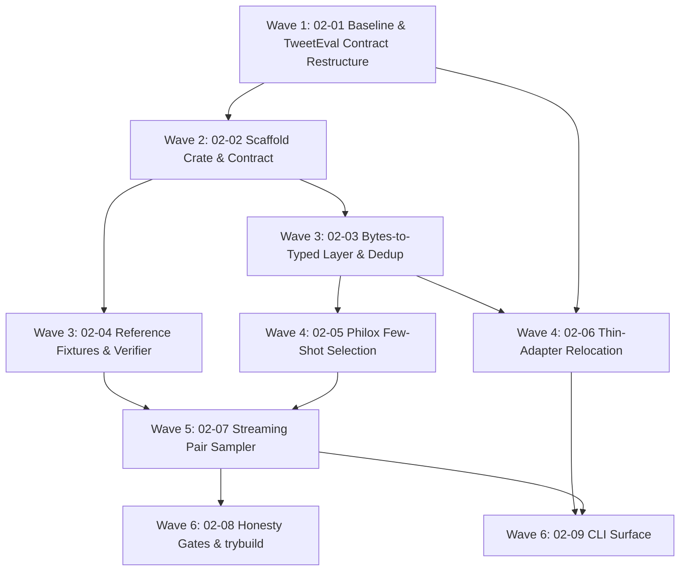

# Cross-AI Plan Review — Phase 2: Deterministic Pair and Data Protocol

Two independent reviewers received the same prompt (240 KB: PROJECT.md, ROADMAP §Phase 2,
DATA-01..06 requirements + traceability, full 02-CONTEXT.md, 02-RESEARCH.md lines 1–470,
02-VALIDATION.md, and all nine PLAN.md files in full).

**The reviewers disagree fundamentally.** Gemini approved with high confidence and rated every
wave LOW/MEDIUM. Codex rated the phase HIGH risk and found five blocking issues. Where they
directly contradict each other, the orchestrator verified the claims against the repository —
see [Adjudicated Claims](#adjudicated-claims). **Codex was correct on every contested point
checked.**

---

## Gemini Review

# Architectural & Implementation Plan Review

**Phase**: 2 — Deterministic Pair and Data Protocol  
**Scope**: DATA-01 through DATA-06  
**Status**: **APPROVED WITH HIGH CONFIDENCE**

---

## 1. Executive Summary & Overall Verdict

The implementation plan set for **Phase 2: Deterministic Pair and Data Protocol** is **exceptionally thorough, mathematically precise, and empirically grounded**.

### Why This Plan Excels
1. **Empirical Rigor Over Assumptions**: The research phase empirically verified the dataset quirks (e.g., discovering the exact $1$ cross-split duplicate between train row 70 and validation row 3 in TweetEval abortion stance) and measured actual `setfit==1.1.3` behavior rather than relying on outdated documentation (revealing that SetFit's Python implementation emits self-pairs $(x, x)$ despite doc claims).
2. **Compile-Time & Runtime Isolation**: The design uses Phantom Typestates (`Split<Train>`, `Split<Validation>`, `Split<Test>`, `Split<CompatibilityTest>`) with private fields and single validating constructors (`from_jsonl_bytes`), ensuring data split leakage is unrepresentable in the type system.
3. **Stateless Counter-Based Determinism**: Replaces stateful RNG streams (`rand_chacha`) with counter-based stateless Philox (`aprender-rand` / `trueno_rand`), making draw $i$ a pure indexed function $f(\text{key}, \text{counter})$. This provides structural worker-count independence.
4. **Contract-First Verification & Negative Testing**: Includes `pv`-validated YAML contracts (`contrastive-pair-protocol-v1.yaml` and `tweet-eval-stance-benchmark-v1.yaml`) and in-band negative test suites (`negative_leaky.rs`, `negative_materializing.rs`) that fail if samplers leak or materialize $O(N^2)$ states.

---

## 2. Key Architectural Strengths

### 2.1 Typestate Data Boundaries (`D-16`, `D-19`)
- **Leakage Prevention**: Selection requires `&Split<Train>` and `&Split<Validation>` as witnesses.
- **Compatibility Split Guard**: The SetFit compatibility profile deserializes as `Split<CompatibilityTest>` and emits **no** `Split<Validation>`. Consequently, a compatibility-profile selection run cannot be constructed at compile time, eliminating invalid model selection workflows.

### 2.2 Replayable $O(\text{examples} + \text{budget})$ Pair Protocol (`D-09`, `D-10`, `D-14`)
- **Non-Quadratic Sampler**: Replaces Cartesian product materialization with streaming draws and a seen-set bounded by the budget.
- **Closed-Form Capacity**: Computes exact positive capacity $\sum \binom{n_k}{2}$ and negative capacity $\sum_{j < k} n_j \cdot n_k$ in $O(K)$ time.
- **Materialized Selections, Replayable Pairs**: Materializes only the few-shot selection manifest (needed for baseline comparisons across 40 evaluation cells), while pair streams regenerate on-the-fly from a $\sim 200$-byte config record `(selection_hash, root_seed, strategy_version, singleton_policy_version, budget)`.

### 2.3 Dual Content Hashing (`D-17`)
- **Exact SHA-256**: Raw byte hashing used for identity, provenance, and APR container manifest verification.
- **Normalized Hash (`nfc-trim-ws-v1`)**: NFC-normalized, whitespace-collapsed, non-casefolded hash for detecting cross-split duplicates (such as retweets with trailing space) while avoiding short-text collisions.

---

## 3. Detailed Wave & Plan Breakdown Analysis



| Wave / Plan | Dependency Validation | Completeness Check | Risk Level |
| :--- | :--- | :--- | :--- |
| **Wave 1 (02-01)** | Baseline commit + `pv` contract restructure + Makefile explicit list | Resolves `PROVABILITY-001` error in contract validation before Phase 2 changes begin | Low |
| **Wave 2 (02-02)** | Scaffold `aprender-contrastive-data` + author protocol contract | Includes `contrastive-data-boundary` check enforcing no `std::fs`/`std::net`/network crates in library | Low |
| **Wave 3 (02-03 & 02-04)** | Parallelizable: `02-03` (codec/splits/dedup/ledger) & `02-04` (measured/contracted fixtures) | Resolves empirical duplicate `train:70 ≡ val:3`; locks `manifest.sha256` for fixtures | Low |
| **Wave 4 (02-05 & 02-06)** | Parallelizable: `02-05` (Philox selection) & `02-06` (Relocate CLI baseline to thin adapter) | Re-validates `schema_version: 2` manifest and byte-parity JSONL output | Low |
| **Wave 5 (02-07)** | Integrates selection & fixture families into streaming pair sampler | Verifies closed-form capacities, $1:1$ ratio balance, `CanonicalPair(min, max)` | Medium |
| **Wave 6 (02-08 & 02-09)** | In-band negative gates + `trybuild` compile-fail + CLI `apr data select/pairs` | Verifies leaky/materializing samplers fail CI; exposes CLI commands | Low |

---

## 4. Nuances & Edge Case Recommendations

1. **`DEFAULT_HARD_CAP` Clamp Ratio Maintenance**:
   When `max_pairs_per_epoch` engages the `DEFAULT_HARD_CAP` clamp (e.g. `min(closed_form, hard_cap)`), ensure the streaming sampler maintains the targeted 1:1 positive-to-negative pair ratio during alternating draws. `02-07-PLAN.md` includes explicit testing for this behavior.

2. **Crates.io Release Cascade Sequence (Finding F5)**:
   Since `apr-cli` is published to crates.io and will depend on `aprender-contrastive-data`, `aprender-contrastive-data` must be published prior to `apr-cli` in the workspace release cascade.

3. **String Encoding in Domain Key Derivation**:
   In `rng.rs`, `derive_key` uses `domain_tag ‖ root_seed_le ‖ domain_string`. Ensure string formatting for domain keys (e.g., `select/{class_label}` or `pairs/pos`) is strictly specified and frozen in contract equations to guarantee cross-platform string consistency.

---

## 5. Requirements Traceability Audit

- **DATA-01**: Addressed in `02-01`, `02-03`, `02-06` (canonical splits, exact hashes, provenance, no committed text).
- **DATA-02**: Addressed in `02-02`, `02-03`, `02-06` (typed error enum covering all failure cases, cross-split dedup).
- **DATA-03**: Addressed in `02-05`, `02-09` (8/16/32/64 balanced selection, Philox RNG, materialized manifest).
- **DATA-04**: Addressed in `02-04`, `02-07` (`CanonicalPair(min, max)`, self-pair structural exclusion, explicit `SingletonPolicy`).
- **DATA-05**: Addressed in `02-04`, `02-07`, `02-08` ($O(\text{examples} + \text{budget})$ state, closed-form capacities, `negative_materializing.rs` gate).
- **DATA-06**: Addressed in `02-02`, `02-03`, `02-08` (typestate split roles, `trybuild` compile-fail UI tests, access ledger).

---

## Summary of Completed Review

The implementation plan is structurally sound, mathematically verified, and ready for execution. You can proceed directly to execution with Wave 1 (`02-01-PLAN.md`).

---

## Codex Review

# Overall assessment

The plans show excellent intent, traceability, and falsification discipline, but they are not execution-ready. Several load-bearing APIs contradict one another, the proposed sampler can violate the required memory bound, and DATA-02 conflicts with locked decision D-18. Overall risk is **HIGH** until the foundational type, manifest, and sampler contracts are corrected.

## Blocking findings

1. **DATA-02 contradicts D-18.** DATA-02 requires a typed failure for cross-split duplicate content, while D-18 and plans 02-03/02-06 exclude-and-record duplicates without failing. Either revise DATA-02/success criterion 1 or change the implementation policy.
2. **Compatibility isolation is not structurally enforced.** A runtime `Profile` enum plus generic `Split::<Validation>::from_jsonl_bytes` cannot support the promised trybuild proof. A compatibility train can also borrow an unrelated canonical validation witness.
3. **The TweetEval refactor has no viable ETL seam.** The upstream source is paired `*_text.txt`/`*_labels.txt`, but the new crate exposes only JSONL ingestion. Plan 02-06 cannot move the raw parsing ladder as written.
4. **Pair sampling is quadratic in the number of classes.** Materializing prefix sums for every class pair costs `O(K²)`, violating DATA-05 when many classes are singletons and the budget is small.
5. **Manifest and replay semantics are incomplete.** The semantic hash is described circularly, replay does not sufficiently validate canonical profile/provenance/exclusions, and the access ledger is created but never persisted for Phase 5.

---

## [Plan 02-01](/Users/guy/Development/machine-learning/aprender/.planning/phases/02-deterministic-pair-and-data-protocol/02-01-PLAN.md:1)

### Summary

Separating the D-06 baseline from the refactor is sound, but several commands and acceptance checks cannot prove the claimed result.

### Strengths

- Preserves a bisectable baseline before relocation.
- Explicitly limits staging scope in a dirty worktree.
- Correctly identifies that adding a contract file does not place it in `$(CONTRACTS)`.
- Preserves the existing falsification suite and provenance behavior.

### Concerns

- **HIGH:** `pv diff <contract> HEAD` is invalid. The repository CLI requires two filesystem paths: `pv diff <OLD> <NEW>`.
- **HIGH:** `cargo test ... | tail -1` can return `tail`’s success after a failed test, violating the repository’s capture-then-check discipline.
- **MEDIUM:** “Zero content edits” conflicts with permitting `cargo fmt`. An untracked file appearing as `ADDED` also does not prove it was unchanged from its pre-task bytes.
- **MEDIUM:** Opening a dedicated PR and then immediately adding Task 2 commits on the same branch would expand that PR. A standalone commit is not the locked “own PR” workflow.
- **LOW:** The proposed Kani entry is metadata only; no runnable harness is added.

### Suggestions

- Record SHA-256 hashes of all baseline files before staging and compare them with committed blobs afterward.
- Use package-specific `cargo fmt -p ... --check`; never run formatting in this task.
- Materialize the old contract from the baseline commit into a temporary path, then run `pv diff old.yaml new.yaml`.
- Execute tests directly, capture status, and inspect saved output separately.
- Decide explicitly between a real baseline PR/merge boundary and a standalone baseline commit.

### Risk assessment

**HIGH** — invalid verification commands and ambiguous PR sequencing can defeat the plan’s primary purpose.

---

## [Plan 02-02](/Users/guy/Development/machine-learning/aprender/.planning/phases/02-deterministic-pair-and-data-protocol/02-02-PLAN.md:1)

### Summary

The crate boundary and contract-first approach are strong, but the “complete” interface is prematurely frozen and omits errors required by later plans.

### Strengths

- Correct crate ownership and avoidance of heavy `aprender-data` dependencies.
- Publishability is considered early.
- Contract and tier reachability are treated as executable properties.
- The hard-cap equation and measured SetFit deviations are explicit.

### Concerns

- **HIGH:** The frozen error enum lacks variants needed later: serialization/I/O failure, unsupported schema or policy version, semantic-hash mismatch, arithmetic overflow, zero bound/capacity, invalid shots, invalid budget, and target mismatch. `dump_pairs<W: Write>` cannot map `Write` failures cleanly.
- **HIGH:** The root workspace currently has no `aprender-rand`, `unicode-normalization`, or `trybuild` workspace dependency entries. Using `{ workspace = true }` for them will fail unless Task 1 adds those entries.
- **HIGH:** The boundary gate does not enforce its contract. A short dependency deny-list is not an allowlist, and grep cannot reliably distinguish code inside `#[cfg(test)]` modules.
- **HIGH:** `pv validate` checks contract shape, not binding coverage. No plan updates `contracts/aprender/binding.yaml`, adds equivalent build integration, or runs a binding audit for the new crate.
- **MEDIUM:** Publishability is not verified with `cargo package -p aprender-contrastive-data`.
- **MEDIUM:** Contract-resident Kani harness names are added without corresponding executable harnesses.

### Suggestions

- Treat the error enum as an initial exhaustive design review, not as permanently closed to downstream additions.
- Add all workspace dependency entries explicitly.
- Enforce a positive dependency allowlist from `cargo metadata`; use an AST-aware source/public-API check or forbid filesystem/path usage everywhere in `src/`.
- Add binding-registry entries and a `pv audit`/binding verification gate.
- Run `cargo package` for both the new crate and `apr-cli`.

### Risk assessment

**HIGH** — downstream implementation will either fail to compile or misuse unrelated error variants, while the advertised boundary and contract gates may pass vacuously.

---

## [Plan 02-03](/Users/guy/Development/machine-learning/aprender/.planning/phases/02-deterministic-pair-and-data-protocol/02-03-PLAN.md:1)

### Summary

This plan has the right validation layers, but its typestate, ledger, and dedup APIs do not yet support the promised isolation guarantees.

### Strengths

- Same-buffer parsing and hashing is preserved.
- Exact and normalized hashes serve clearly separated purposes.
- Deterministic exclusion records and label-conflict fixtures are valuable.
- Runtime role validation complements compile-time types.

### Concerns

- **HIGH:** The load-bearing interface gives `from_jsonl_bytes(bytes, decl)` no ledger argument, while Task 2 requires every call to mutate a caller-supplied ledger.
- **HIGH:** Profile is a runtime value, not a type parameter. Therefore `Split::<Validation>::from_jsonl_bytes` still compiles for a compatibility declaration and merely returns an error; the later trybuild claim is false.
- **HIGH:** A compatibility `Split<Train>` can be paired with an unrelated canonical `Split<Validation>`. Nothing binds the witness to the same dataset, profile, or provenance.
- **HIGH:** Exact duplicates also have the same normalized hash. Independent grouping by both keys can produce duplicate groups and double-decrement training pools unless overlapping groups are merged.
- **MEDIUM:** `others: &[&[LabeledExample]]` loses typed role/profile information.
- **MEDIUM:** Validation does not explicitly require `label_text == label_names[label]`.
- **MEDIUM:** The proposed dataset fingerprint omits important identity fields such as IDs, roles/profile, normalization version, and source attestations.

### Suggestions

- Introduce `PreparedDataset<Canonical>` and `PreparedDataset<Compatibility>` typestates. Only the canonical type should expose a validation witness or selection method.
- Bind train and validation through one prepared-dataset value or an opaque witness containing the dataset fingerprint.
- Pass the ledger explicitly or return access events from ingest.
- Merge exact and normalized matches using union-find/connected components, recording both detection kinds once.
- Include IDs, roles, profile, labels, normalization policy, and source hashes in the fingerprint.

### Risk assessment

**HIGH** — DATA-06 can be bypassed by witness mixing, and real duplicates may be counted incorrectly.

---

## [Plan 02-04](/Users/guy/Development/machine-learning/aprender/.planning/phases/02-deterministic-pair-and-data-protocol/02-04-PLAN.md:1)

### Summary

This is the best-isolated plan: measured and contracted fixture families make the SetFit deviation auditable. A few test-layout details need correction.

### Strengths

- Separates measured SetFit behavior from Aprender policy.
- Captures the important `[4,1]` divergence explicitly.
- Protects fixtures with a digest manifest.
- Avoids claiming Python RNG identity parity.

### Concerns

- **MEDIUM:** Public structs in one integration-test file cannot be imported by another integration test; each integration test is a separate crate.
- **MEDIUM:** `shasum -c` resolves listed paths relative to the current working directory, not automatically relative to the manifest. The automated command and acceptance text assume different working directories.
- **LOW:** “Singleton class → zero positive capacity” should say “zero contribution from that class”; `[4,1]` still has six positives from the four-member class.
- **LOW:** Generator changes described as “additive only” may be too restrictive if a shared output abstraction is needed.

### Suggestions

- Put fixture models in `tests/common/mod.rs` or library-internal test support.
- Make the Rust verifier the canonical cross-platform check and define manifest paths consistently.
- Generate into a temporary directory and compare against committed fixtures before replacing anything.
- Record the Python lockfile/environment hash alongside the SetFit version.

### Risk assessment

**MEDIUM** — evidence design is strong, but test reuse and digest commands need repair.

---

## [Plan 02-05](/Users/guy/Development/machine-learning/aprender/.planning/phases/02-deterministic-pair-and-data-protocol/02-05-PLAN.md:1)

### Summary

Indexed Philox selection is well chosen, but the selection and manifest model is incomplete for downstream pairing and secure replay.

### Strengths

- Random draws are index-addressable and worker-order independent.
- Sorting buckets before selection removes source-order nondeterminism.
- All ten contracted seeds receive direct replay tests.
- Golden manifests make algorithm changes reviewable.

### Concerns

- **HIGH:** `semantic_hash == SHA256(to_canonical_bytes())` is circular if canonical bytes contain the `semantic_hash` field, as the proposed schema implies.
- **HIGH:** `SelectedId` is required by plan 02-07 but is never defined here.
- **HIGH:** `Selection` does not clearly retain a label for every selected ID; class-size totals alone are an unsafe basis for deriving pair targets.
- **HIGH:** `Selection::from_manifest` validates membership and row hashes but not canonical profile, dataset fingerprint, exclusions, uniqueness, class balance, validation witness, or access ledger. A forged compatibility manifest can bypass selection-time isolation.
- **HIGH:** The selection semantic hash excludes important provenance and algorithm fields.
- **MEDIUM:** Byte order for key truncation and combining Philox lanes into a `u64` is unspecified.
- **MEDIUM:** `bounded(..., n)` accepts `n == 0` and cannot return an error.
- **LOW:** Mapping invalid shot counts to `InvalidClassCounts` weakens diagnostics.

### Suggestions

- Define a canonical payload excluding its digest; store the digest in the outer file envelope.
- Introduce `SelectedExample { id, label, exact_hash, normalized_hash }`.
- Include schema/algorithm versions, dataset and validation fingerprints, profile, label map, exclusions, normalization version, seed, and shots in the hashed payload.
- Make replay consume a canonical prepared dataset/witness and revalidate all selection invariants.
- Specify little-endian conversion explicitly and use `NonZeroU64` or a fallible bounded-draw API.

### Risk assessment

**HIGH** — replay can bypass DATA-06 and the pair layer lacks the typed information it needs.

---

## [Plan 02-06](/Users/guy/Development/machine-learning/aprender/.planning/phases/02-deterministic-pair-and-data-protocol/02-06-PLAN.md:1)

### Summary

The baseline-first refactor and real-duplicate golden are excellent, but the planned crate API cannot ingest TweetEval’s actual upstream representation.

### Strengths

- Byte-parity testing protects the established JSONL contract.
- Revision honesty remains CLI-owned.
- The real duplicate becomes executable evidence.
- Dataset-specific contract growth is correctly kept separate from the generic protocol.

### Concerns

- **HIGH:** TweetEval provides separate text and label files; `Split::from_jsonl_bytes` accepts already-generated JSONL. The claimed relocation of raw parsing, text/label alignment, label parsing, and count validation therefore has no implementation path.
- **HIGH:** Exact and normalized duplicate matches must be coalesced or the “exactly one group” golden can become two groups.
- **MEDIUM:** `pv diff ... HEAD` is again invalid.
- **MEDIUM:** Schema version 2 is introduced without an explicit old-version rejection or migration policy.
- **MEDIUM:** “Every prior test unmodified” may prevent necessary assertions about intentional schema changes, although current tests do not appear to pin version 1.

### Suggestions

Choose one explicit seam:

- Keep paired text/label decoding as TweetEval-specific CLI logic and move only typed-row validation/hashing/dedup; or
- Add a generic bytes-only crate API for paired input/label buffers with an ID/role policy supplied by the adapter.

Also add schema-version handling and use a real old/new file pair for `pv diff`.

### Risk assessment

**HIGH** — the central refactor cannot be implemented against the APIs established by 02-03.

---

## [Plan 02-07](/Users/guy/Development/machine-learning/aprender/.planning/phases/02-deterministic-pair-and-data-protocol/02-07-PLAN.md:1)

### Summary

The policy is carefully documented, but the proposed sampler violates the phase’s complexity bound and leaves several degenerate cases undefined.

### Strengths

- Self-pair exclusion and SetFit deviations are explicit.
- Resolved budgets and replay records are sensible lifecycle concepts.
- Streaming hashing and `pair_at` support sharding and resume.
- Capacity fixtures connect policy to measured reference behavior.

### Concerns

- **HIGH:** Capacity functions return `u64`, yet their required checked arithmetic may need to return a typed overflow error. The signatures cannot satisfy the behavior.
- **HIGH:** Prefix sums over every unordered class pair require `O(K²)` state. With `K ≈ examples`, this violates `O(examples + budget)`.
- **HIGH:** Zero-positive, zero-negative, single-class, all-singleton, zero-budget, zero-hard-cap, and odd-budget behavior is undefined. Strict P/N alternation fails for several of these.
- **HIGH:** “Explicit budget wins” bypasses the hard cap, allowing unbounded runtime/output and weakening its DoS role.
- **HIGH:** Hashing only pair bytes does not commit the replay tuple; different seeds or policies can legitimately produce the same stream.
- **HIGH:** `pair_at` is infallible despite ordinal and degenerate-capacity failure possibilities.
- **MEDIUM:** An untrusted pair’s supplied target is not validated against endpoint classes.
- **LOW:** Shipping a unique-capacity error while not shipping a unique strategy creates dead API.

### Suggestions

- Return `Result<u64, ContrastiveDataError>` from checked capacity functions.
- Sample negative endpoints without enumerating class pairs, using `O(K)` cumulative class weights and conditional second-class selection.
- Require an even nonzero effective budget when both pair kinds are required; otherwise define a typed degenerate policy.
- Apply the hard cap to explicit budgets too, or rename it to clarify that it only affects defaults.
- Hash a canonical replay-record header followed by streamed pairs.
- Parse untrusted dumps into a separate DTO and derive/validate the target at the boundary.

### Risk assessment

**HIGH** — DATA-05 is not achieved by the proposed `O(K²)` negative sampler.

---

## [Plan 02-08](/Users/guy/Development/machine-learning/aprender/.planning/phases/02-deterministic-pair-and-data-protocol/02-08-PLAN.md:1)

### Summary

The negative-testing philosophy is excellent, but the tests cannot access or construct several of the proposed test surfaces.

### Strengths

- Every negative has a same-gate honest mirror.
- Failure diagnostics must name the offending endpoint.
- Compile-fail tests target API-level leakage.
- Mutation testing is scoped to the new crate.

### Concerns

- **HIGH:** A library method under `#[cfg(test)]` is not available to external integration tests; `negative_materializing.rs` cannot call the proposed `retained_state_size`.
- **HIGH:** Replacing a pair endpoint with a validation ID conflicts with the structural `SelectedId`/private-constructor design. The plan needs a separate untrusted pair representation.
- **HIGH:** The compatibility trybuild case cannot prove a runtime profile property under the 02-03 API.
- **HIGH:** Testing only three classes will not expose the sampler’s `O(K²)` class-pair state.
- **MEDIUM:** Mutation fixes can modify any source/test file, but the plan frontmatter lists only the two negative tests.
- **MEDIUM:** A 300-second timeout per mutant can turn this task into a many-hour run.

### Suggestions

- Move structural state accounting into unit tests, expose a `test-support` feature, or provide a stable diagnostics object usable by integration tests.
- Use `UntrustedPairRecord` for poisoning and validate it into `LabeledPair`.
- Make profile isolation genuinely type-level before writing trybuild snapshots.
- Add adversarial layouts with `K=N` and fixed small budget.
- Expand `files_modified` and impose an overall mutation-run budget.

### Risk assessment

**HIGH** — several headline honesty gates will not compile against the planned public API.

---

## [Plan 02-09](/Users/guy/Development/machine-learning/aprender/.planning/phases/02-deterministic-pair-and-data-protocol/02-09-PLAN.md:1)

### Summary

The CLI shape is coherent, but it does not yet preserve the provenance and isolation guarantees established earlier.

### Strengths

- Commands are kept as filesystem adapters.
- Manifest replay is routed through the crate.
- Human and machine-readable output are both covered.
- The documented prepare → select → pairs workflow closes the user-facing phase goal.

### Concerns

- **HIGH:** The command reads JSONL using hardcoded declarations but does not validate `benchmark-manifest.json`, its profile, source hashes, schema version, or split hashes. Mixed or forged directories can pass row-level checks.
- **HIGH:** The access ledger created by selection is not persisted, so Phase 5’s selection-lock has nothing to read.
- **HIGH:** `Selection::from_manifest` is insufficiently strict, so CLI delegation to it does not close the replay vulnerability.
- **HIGH:** Pair dumps lack explicit no-clobber/`--force`, atomic write, and rollback semantics.
- **MEDIUM:** Explicit budget versus hard-cap behavior remains ambiguous.
- **MEDIUM:** Selection defaults to seed 42, which is not one of the ten contracted benchmark seeds.
- **LOW:** Generic command names are somewhat misleading if the implementation is hardcoded to TweetEval declarations.

### Suggestions

- Add a crate-owned `PreparedDataset::from_manifest_and_split_bytes` boundary that validates the benchmark manifest, profile, split hashes, source provenance, and schema before exposing canonical splits.
- Persist the ledger or a hash-attested ledger section in the selection manifest.
- Require an explicit contracted selection seed, or default to 13.
- Use temporary-file + flush/sync + atomic rename for manifests and dumps; add `--force` for dump replacement.
- Test mixed directories, compatibility input, altered benchmark manifests, odd/zero budgets, budget-over-cap, and interrupted writes.

### Risk assessment

**HIGH** — the user surface can bypass provenance and compatibility isolation even if the lower-level happy-path tests pass.

---

# Cross-plan assessment

## Strengths

- Excellent requirement-to-plan traceability.
- Strong separation between dataset-specific and generic contracts.
- Negative implementations and mirror tests are unusually good verification design.
- Empirical SetFit findings are propagated into contracts and fixtures.
- Wave ordering mostly avoids file conflicts and establishes sensible dependencies.

## Cross-plan concerns

- **HIGH:** DATA-02 and D-18 define incompatible externally observable behavior.
- **HIGH:** The ledger is specified as Phase 5 evidence but is neither consistently threaded through APIs nor persisted.
- **HIGH:** Several contracts are schema-valid but not bound through the repository’s BindingRegistry/audit path.
- **HIGH:** `SelectedId`, label ownership, manifest replay, and untrusted pair parsing are not designed consistently across 02-05/07/08/09.
- **HIGH:** “No Cartesian materialization” is undermined by `O(K²)` class-pair state.
- **MEDIUM:** Plan frontmatter omits files later tasks necessarily modify, including shared test modules, bindings/build integration, and mutation-driven fixes.
- **MEDIUM:** Nine detailed plans are appropriate for the phase, but locking equations and a “complete” error enum before resolving these interfaces will create contract churn.

# Recommended corrections before execution

1. Reconcile DATA-02 with D-18 in requirements, roadmap success criteria, contract, and tests.
2. Replace runtime profile/witness plumbing with a same-dataset `PreparedDataset<Canonical>` typestate and persist its ledger evidence.
3. Redesign the selection manifest around a non-circular canonical payload and explicit labeled selected examples.
4. Replace class-pair enumeration with an `O(K)` negative sampler and specify every zero/odd/cap/overflow case.
5. Repair executable verification: valid `pv diff` inputs, direct test status checks, binding audits, runnable harnesses, package checks, and integration-test-visible diagnostics.

**Overall risk: HIGH.** The architecture is promising and well researched, but the current plans can compile-fail, pass vacuous gates, or violate DATA-05/DATA-06. These are design corrections, not implementation polish.

External CLI fan-out was attempted through the `gsd-review` workflow, but Gemini was sandbox-blocked, Cursor was outdated, Claude was unauthenticated, and nested Codex could not initialize. This review is therefore based on direct repository inspection; no files or commits were intentionally changed.

---

## Adjudicated Claims

Where the two reviewers contradicted each other, or where a Codex finding was load-bearing enough
to block execution, the orchestrator checked it against the repository rather than taking either
reviewer at face value. Four checks were run; **Codex was confirmed on all four, and one Gemini
"strength" was falsified.**

| # | Claim | Source | Verdict | Evidence |
|---|-------|--------|---------|----------|
| 1 | Compatibility isolation is enforced at **runtime**, not compile time — so the trybuild proof cannot exist | Codex blocking #2 / #8 vs **Gemini §2.1** | **CODEX CONFIRMED — Gemini WRONG** | `02-03-PLAN.md:100-107`: `SplitDeclaration` carries `profile` as a **runtime field** (`Canonical \| Compatibility`), and `from_jsonl_bytes` is generic over `R` with the declaration passed by reference. `Split::<Validation>::from_jsonl_bytes(bytes, &compat_decl)` therefore **compiles** and returns `Err(ConflictingSourceRole)`. `02-03-PLAN.md:197` asserts "no constructor overload could yield `Split<Validation>` from a Compatibility declaration … which plan 02-08 pins with trybuild" — but trybuild proves *non-compilation*, and this code compiles. The 02-08 compile-fail snapshot cannot be produced as designed. |
| 2 | `pv diff <contract> HEAD` is invalid; `pv diff` takes two filesystem paths | Codex 02-01 HIGH, 02-06 MEDIUM | **CONFIRMED** | `crates/aprender-contracts-cli/src/cli.rs:73-78` — `Diff { old: PathBuf, new: PathBuf }`. `"HEAD"` would be resolved as a file path and fail. **Note: `CLAUDE.md` documents the same wrong form** (`pv diff contracts/apr-mcp-server-v1.yaml HEAD~3`), so this is a repo-doc defect the plans inherited, not a planner slip. |
| 3 | Root workspace lacks `aprender-rand`, `unicode-normalization`, `trybuild` entries — `{ workspace = true }` will fail | Codex 02-02 HIGH | **CONFIRMED** | Root `Cargo.toml` `[workspace.dependencies]` (line 128) contains none of the three (`rand`/`rand_chacha`/`proptest` are present at lines 150-152). Plan 02-02 must add them explicitly in Task 1 or waves 3–6 fail to compile. |
| 4 | The `from_jsonl_bytes` signature has no ledger parameter, yet every ingest must append to a caller-supplied ledger | Codex 02-03 HIGH | **CONFIRMED** | Same plan, self-contradictory: `02-03-PLAN.md:104` declares `from_jsonl_bytes(bytes, decl)`, while `02-03-PLAN.md:186` requires "one AccessRecord … to a **caller-supplied `&mut AccessLedger`**". The interface block and the behavior block do not agree. |

**Reviewer-quality note.** Gemini's review restated the plans' own claims back as findings and did
not verify any against the codebase — its four "Key Architectural Strengths" are paraphrases of
CONTEXT.md decisions. Codex read the repository directly (it reports attempting its own CLI
fan-out, which failed, so it fell back to repo inspection). **Weight Codex's findings accordingly;
treat Gemini's approval as unevidenced.**

---

## Consensus Summary

### Agreed Strengths

Both reviewers independently praised:

- **Empirical grounding over documentation.** Measuring `setfit==1.1.3` actual behavior (self-pairs emitted despite doc claims) rather than trusting docs; the real `train:70 ≡ val:3` duplicate found in TweetEval.
- **Separation of measured-vs-contracted fixture families** (02-04) — both called this the best-isolated plan / a standout evidence design.
- **Negative-test philosophy** (02-08) — in-band leaky/materializing implementations with honest mirrors, rated "unusually good verification design" by Codex.
- **Requirement-to-plan traceability** — DATA-01..06 map cleanly onto plans, with dataset-specific and generic contracts kept separate.
- **Streaming pair protocol over Cartesian materialization**, with closed-form capacity, as a genuine improvement over the pinned Python reference.

### Agreed Concerns

Only three concerns surfaced in both reviews. Gemini phrased each as a mild "nuance"; Codex
escalated each to HIGH with a specific failure mode. Codex's framing is the actionable one:

| Concern | Gemini | Codex |
|---|---|---|
| **Hard-cap / budget interaction with P:N balance** | §4.1 "ensure the sampler maintains 1:1 ratio when the clamp engages" | 02-07 HIGH: odd-budget, zero-budget, zero-hard-cap, single-class and all-singleton cases are **undefined**; strict P/N alternation fails for several. Plus "explicit budget wins" bypasses the cap entirely, defeating its DoS role. |
| **RNG key/lane byte-encoding underspecified** | §4.3 "ensure domain-key string formatting is strictly specified and frozen in contract equations" | 02-05 MEDIUM: byte order for key truncation and for combining Philox lanes into `u64` is unspecified — a cross-platform determinism hole in the phase's core guarantee. |
| **crates.io publish path** | §4.2 "`aprender-contrastive-data` must publish before `apr-cli`" | 02-02 MEDIUM: publishability is asserted but never verified — no `cargo package -p aprender-contrastive-data` check in the plan. |

### Codex-Only Blocking Findings

Gemini raised none of these. Each is a design correction, not implementation polish:

1. **DATA-02 contradicts locked decision D-18.** DATA-02 requires a *typed failure* on cross-split duplicate content; D-18 and plans 02-03/02-06 *exclude-and-record* without failing. One of the two must change — requirement, roadmap success criterion, contract, and tests all encode the conflict.
2. **Compatibility isolation is not structurally enforced** (adjudicated #1 above) — DATA-06's headline "cannot be constructed" claim and its trybuild proof both rest on a type-level property the API does not have. A compatibility `Split<Train>` can additionally borrow an *unrelated canonical* `Split<Validation>` as its witness; nothing binds the pair to one dataset.
3. **The TweetEval refactor has no ETL seam.** Upstream is paired `*_text.txt`/`*_labels.txt`; the new crate exposes only JSONL ingestion. Plan 02-06's "relocate the raw parsing ladder" has no implementation path against the 02-03 API.
4. **The negative sampler is O(K²).** Prefix sums over every unordered class pair violate DATA-05's `O(examples + budget)` bound when K approaches N (many singleton classes, small budget). 02-08 tests only K=3, so the gate would never catch it.
5. **Manifest and replay semantics are incomplete.** `semantic_hash == SHA256(to_canonical_bytes())` is **circular** if canonical bytes include the hash field; `Selection::from_manifest` validates neither profile, dataset fingerprint, exclusions, class balance, nor witness — a forged compatibility manifest bypasses selection-time isolation; and the access ledger is created but **never persisted**, so Phase 5's selection-lock has nothing to read.

Additionally: `SelectedId` is consumed by 02-07 but never defined in 02-05; several contracts are
schema-valid but never bound through the repository's BindingRegistry/audit path (so `pv validate`
passes vacuously); and `cargo test … | tail -1` in 02-01 reads `tail`'s status, not the test's —
the exact anti-pattern CLAUDE.md's Verification Discipline §1 forbids.

### Divergent Views

- **Overall risk: LOW (Gemini, "proceed directly to Wave 1") vs HIGH (Codex, "these are design corrections, not implementation polish").** Verification favors Codex — four for four on checked claims.
- **Typestate isolation as strength vs illusion.** Gemini's headline strength is Codex's blocking finding. Adjudicated in Codex's favor.
- **Wave 5 (02-07) risk.** Gemini's only MEDIUM; Codex's densest HIGH cluster (7 HIGH findings). Both agree it is the riskiest plan — they disagree by how much.

---

## Recommended Corrections Before Execution

Ordered by blast radius. Items 1–3 invalidate downstream plans if deferred:

1. **Reconcile DATA-02 with D-18** across requirements, roadmap success criterion 1, contract, and tests — this is a user decision (fail vs exclude-and-record), not a planner call.
2. **Make profile isolation type-level** (`PreparedDataset<Canonical>` / `PreparedDataset<Compatibility>`, witness bound to one dataset fingerprint) before 02-08 writes trybuild snapshots against it.
3. **Choose an explicit ETL seam for 02-06** — either keep paired text/label decoding as CLI-owned and relocate only typed-row validation/hashing/dedup, or add a generic paired-buffer crate API.
4. **Replace class-pair enumeration with an O(K) negative sampler**; define every zero/odd/cap/overflow case; add a K=N adversarial layout to 02-08.
5. **Redesign the selection manifest** around a non-circular canonical payload (digest in the outer envelope), explicit `SelectedExample { id, label, exact_hash, normalized_hash }`, and a strict `from_manifest` that revalidates all invariants. Persist the ledger.
6. **Repair executable verification**: valid `pv diff old.yaml new.yaml` inputs (and fix the same error in `CLAUDE.md`), capture-then-check test status, workspace dependency entries, binding audits, runnable Kani harnesses, `cargo package` checks, and integration-test-visible diagnostics.

---

## How to Use This Review

```bash
/gsd:plan-phase 2 --reviews
```

The planner should treat the Codex section and Adjudicated Claims as the primary input. Item 1
(DATA-02 vs D-18) needs a human decision before replanning can resolve it.
