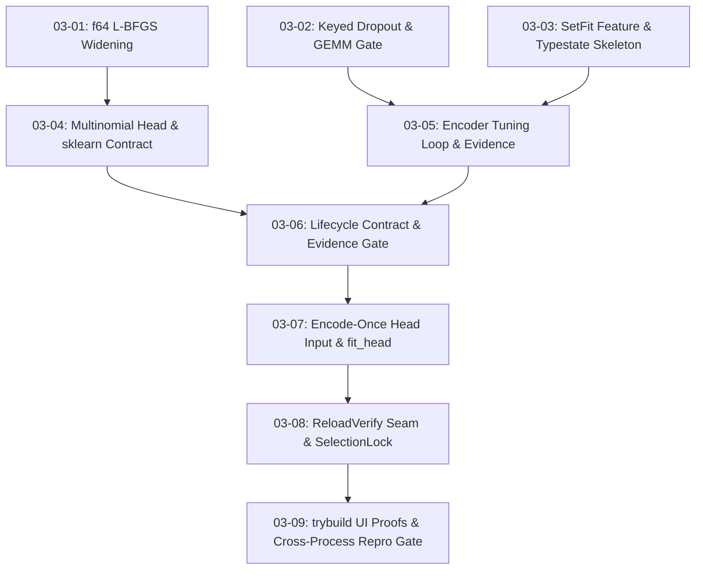

# Cross-AI Plan Review — Phase 3: Faithful Two-Stage Trainer and Head

Reviewed by 2 external AI systems. Prompt included PROJECT.md, the ROADMAP Phase 3
section, full REQUIREMENTS.md, 03-CONTEXT.md, 03-VALIDATION.md, 03-RESEARCH.md, and
all nine PLAN.md files (310 KB total).

**The two reviewers reached opposite verdicts.** Read the Consensus Summary first.

---

## Codex Review

*Model: codex exec default. Ran agentically with `--sandbox read-only`; it read the
repository in addition to the prompt. A trailing self-referential process note about its
own attempt to invoke other reviewer CLIs has been removed; the review is otherwise verbatim.*

# Cross-AI Plan Review — Phase 3

## Overall summary

The plan set is unusually disciplined about typestate, contracts, falsification tests, deterministic execution, and numerical references. The logical dependency graph is mostly sound. However, several design holes would either make valid SetFit runs fail, allow claimed lifecycle guarantees to be bypassed, or produce reproducibility evidence for the intended execution rather than the execution that actually occurred. The largest blockers are the zero-norm parameter evidence formula, missing optimizer-loop details, incomplete dropout keying, spoofable reload/selection-lock interfaces, and recomputed rather than recorded execution digests.

**Overall risk: HIGH.** The architecture is strong, but the remaining issues affect core correctness claims rather than polish.

## Dependency and wave review

The functional graph is sound:

```text
Wave 1: 03-01   03-02   03-03
          │       │       │
Wave 2: 03-04     └──┬────┘
          │          03-05
          └────┬─────┘
Wave 3:      03-06
               │
Wave 4:      03-07
               │
Wave 5:      03-08
               │
Wave 6:      03-09
```

Transitive dependencies cover the apparent cross-plan uses: 03-07 reaches the head through 03-06→03-04, and 03-09 reaches all earlier determinism work through 03-08.

One operational defect remains:

- **HIGH:** 03-01, 03-02, and 03-03 each perform `git checkout`/branch creation while Wave 1 is described as parallel. Concurrent branch operations and commits in one shared worktree can race on the index, branch reference, or commit parent. Establish the phase branch once before wave execution, or give each parallel executor an isolated worktree and merge afterward.

---

## [03-01 — f64 L-BFGS widening](/Users/guy/Development/machine-learning/aprender/.planning/phases/03-faithful-two-stage-trainer-and-head/03-01-PLAN.md)

### Summary

A sensible isolated first-wave change, but the compatibility and numerical tests need to defend more than source compilation.

### Strengths

- Isolates the shared contracted optimizer change before the head depends on it.
- Preserves the existing f32 entry point and avoids a new optimizer.
- Correctly identifies `elapsed_time` as unsuitable for semantic hashes.
- Requires contract versioning and `pv diff` evidence.

### Concerns

- **MEDIUM:** “Zero public API break” is not proven by compiling existing tests. Replacing the public struct with a generic alias/default parameter can still be a Rust semver break.
- **MEDIUM:** Genericization could change existing f32 iteration trajectories, statuses, or line-search behavior while all current convergence tests remain green.
- **MEDIUM:** T-3-02 promises non-finite handling, but `falsify_lbfgs_003_f64` only describes pathological finite input.
- **LOW:** Strict objective decrease requires access to accepted-step history; the plan does not specify whether this adds observable API or test-only instrumentation.

### Suggestions

- Keep `pub struct LBFGS` as an unchanged wrapper over a private generic core; add a separate `LBFGSF64`.
- Record old-versus-new f32 golden results for solution bits, status, iterations, and accepted objectives.
- Test NaN/Inf from `x0`, objective, gradient, and line search in both widths.
- Add a semver/API check rather than relying only on call-site compilation.

### Risk assessment

**MEDIUM** — contained, but shared numerical code needs stronger backwards-compatibility evidence.

---

## [03-02 — keyed dropout and GEMM gate](/Users/guy/Development/machine-learning/aprender/.planning/phases/03-faithful-two-stage-trainer-and-head/03-02-PLAN.md)

### Summary

The counter-based RNG direction is right, but the proposed dropout coordinate is incomplete and can reuse masks across the two sentence branches.

### Strengths

- Removes `StdRng` state and version dependence from the SetFit path.
- Uses an independent domain tag and golden-pinned derivation.
- Measures the GEMM thread-count concern instead of asserting safety.
- Limits the new dependency to an acyclic in-tree leaf crate.

### Concerns

- **HIGH:** The key is `(root_seed, site, step, element)` but D-15 requires a block/call coordinate. If the pair’s A and B sentences are forwarded separately at the same step, corresponding elements receive identical masks. That introduces artificial correlation and diverges from reference dropout.
- **HIGH:** The contingent `aprender-compute` change is pre-authorized without its own contract update or plan, despite research saying it should be a separate contracted change if needed.
- **MEDIUM:** `round(p·2^64)` from `f64` is underspecified. A normal floating multiplication loses low bits; exact IEEE-754 decoding or a rational rate representation is required.
- **MEDIUM:** A rate close to 1 can produce an infinite f32 inverted-dropout scale even though `p < 1`.
- **MEDIUM:** Different Rayon pool sizes do not prove the hazard-window parallel branch was actually selected. The gate should report or assert dispatch/partition details.
- **LOW:** “Host max” may equal one in constrained CI, making the `THREADS > 1` assertion impossible.

### Suggestions

- Either encode both pair sides as one `2B` batch or add a deterministic `forward_ordinal/block` coordinate to the counter.
- Specify exact rate-to-threshold conversion and validate finite scaling.
- If the GEMM gate is red, stop and create a contracted compute-kernel amendment rather than modifying shared BLIS code contingently.
- Use fixed pool sizes such as 1 and 3, and assert the actual dispatch/partition branch.

### Risk assessment

**HIGH** — mask reuse would alter the training objective while still appearing deterministic.

---

## [03-03 — feature, typestate, and config](/Users/guy/Development/machine-learning/aprender/.planning/phases/03-faithful-two-stage-trainer-and-head/03-03-PLAN.md)

### Summary

The typestate skeleton and trainer-local determinism primitives are well placed, but the validated configuration can currently be bypassed through deserialization.

### Strengths

- Correct crate placement and acyclic feature propagation.
- Uses state-specific associated evidence rather than `Option`.
- Separates trainer-local fixed-order reductions from compute kernels.
- Adds the missing warmup-plus-linear-decay schedule.
- Explicitly records the known packaging failure.

### Concerns

- **HIGH:** Deriving `Deserialize` directly on `SetFitTrainConfig` creates a second construction path that bypasses validation. `deny_unknown_fields` does not reject invalid numeric values.
- **HIGH:** The feature matrix adds no-default and default+setfit legs, but not the required `aprender-train --all-features` leg.
- **MEDIUM:** “All 12 knobs reject invalid forms” conflicts with `root_seed`, for which every `u64` is valid. The exact twelve fields are also not tabulated unambiguously.
- **MEDIUM:** The plan chooses `round(warmup_ratio·steps)` without pinning that rule to the reference. The pinned HF path should be checked; this commonly uses ceiling semantics.
- **MEDIUM:** Device resolution and environment probing are mixed into a serializable configuration. Requested configuration and resolved runtime device should be distinct.
- **LOW:** Zero-match freeze validation is deferred until tuning; ensure it happens before baseline encodes or optimizer construction, not merely before the first update.

### Suggestions

- Deserialize through a private wire type and `TryFrom`, or use `#[serde(try_from = "...")]`.
- Split `RequestedSetFitConfig` from `ResolvedSetFitConfig`; persist both where provenance requires them.
- Add a table naming every field, its validation phase, and its consumer.
- Pin the exact warmup-step formula from the reference implementation.
- Add the all-features train leg.

### Risk assessment

**HIGH** — invalid serialized configuration would undermine TRN-02 and artifact verification.

---

## [03-04 — multinomial head](/Users/guy/Development/machine-learning/aprender/.planning/phases/03-faithful-two-stage-trainer-and-head/03-04-PLAN.md)

### Summary

The head design is coherent and correctly catches the sklearn factor-of-two convention, but the newly hand-written objective and gradient lack a direct numerical gradient check.

### Strengths

- General capability is correctly placed in `aprender-core`.
- K=2 and K=3 are both exercised.
- Stable softmax, typed convergence failures, deterministic initialization, and unpenalized intercept are explicit.
- The wrong-lambda control makes the reference test meaningfully falsifiable.
- Correctly excludes duration from deterministic reports.

### Concerns

- **HIGH:** There is no finite-difference gradient test for the f64 softmax-NLL plus L2 objective. Reference predictions alone are not a sufficient unit test for the analytic gradient.
- **HIGH:** Input validation omits duplicate/empty ordered labels, zero feature dimension, missing represented classes, non-finite or non-positive `C`, and prediction dimension mismatches.
- **MEDIUM:** Finite input values can still produce infinite dot products. Testing logits around 1000 does not cover overflow during accumulation.
- **MEDIUM:** The unpenalized intercept has gauge freedom. Zero initialization may preserve a centered gauge, but this should be explicit rather than treated as an optimizer accident.
- **MEDIUM:** The plan silently corrects locked D-04 from `1/(Cn)` to `1/(2Cn)`. The correction is justified, but CONTEXT.md should be amended so implementation and locked decisions do not disagree.
- **LOW:** The pinned Python environment is procedural rather than self-describing; the script itself does not enforce its dependency versions.

### Suggestions

- Add central-difference gradient checks for K=2/K=3, λ=0/λ>0, including the intercept-exclusion terms.
- Reject duplicate labels, empty dimensions, absent classes, and invalid `C`.
- Accumulate prediction logits in f64 and return a typed non-finite-logit error.
- Center intercepts explicitly or use a documented gauge constraint.
- Make the fixture generator self-pinning, such as a PEP 723/uv-locked script.

### Risk assessment

**HIGH** — the head is the phase’s one new numerical algorithm and needs independent gradient validation.

---

## [03-05 — encoder tuning and evidence capture](/Users/guy/Development/machine-learning/aprender/.planning/phases/03-faithful-two-stage-trainer-and-head/03-05-PLAN.md)

### Summary

This is the highest-risk implementation plan. Its evidence design is strong in outline, but several missing loop mechanics and one undefined formula threaten both fidelity and gate viability.

### Strengths

- Captures evidence before deciding thresholds.
- Uses named parameters and deterministic map ordering.
- Separates full evidence from a compact summary.
- Includes before/after embeddings and endpoint loss behavior.
- Uses synthetic text and real Phase 2 pairing machinery.

### Concerns

- **HIGH:** `‖Δθ‖/‖θ_init‖` is undefined for zero-initialized parameters. Transformer biases are commonly exactly zero. The current rule yields NaN/Inf and can either reject every valid run or pass incorrectly.
- **HIGH:** The loop never explicitly clears gradients. Without `zero_grad` before backward or after each step, gradients accumulate across batches.
- **HIGH:** Scheduler ordering is unspecified and appears to apply the scheduled LR after the optimizer step, making the first update run at full LR rather than the warmup LR.
- **HIGH:** The same step is assigned to both pair-side forwards; combined with 03-02, this can reuse dropout masks.
- **HIGH:** Epsilon is measured on a tiny synthetic encoder, not the contracted MiniLM parameter-scale distribution. That cannot justify a per-parameter production threshold, especially for a large sparse embedding table.
- **HIGH:** The plan later recomputes pair-order evidence rather than recording it. The tuning loop must hash the actual consumed pair ordinals and actual batch boundaries in-band.
- **MEDIUM:** Initial norms alone cannot produce `‖θ_final−θ_init‖`; full initial tensor snapshots are required. Their memory cost and lifecycle are not planned.
- **MEDIUM:** Reacquiring `trainable_parameters_mut()` across steps must preserve name/order because AdamW moment state is positional. The plan does not assert registry-order stability.
- **MEDIUM:** Arbitrarily permuting a replay-only stream can become O(B²) unless pair lookup is random-access by ordinal or the bounded descriptors are materialized once.
- **MEDIUM:** Device and maximum-length configuration are validated but not visibly consumed by `run_tuning`.
- **MEDIUM:** A first-k versus last-k condition calibrated on one trace may reject correct noisy minibatch runs across other seeds/configurations.
- **LOW:** A hash beside mutable evidence is linkage/self-consistency, not cryptographic non-forgeability.

### Suggestions

- Define a zero-norm branch, such as an absolute delta floor, or a hybrid denominator `max(initial_norm, contracted_scale)`, and amend D-10 before implementation.
- Spell out the exact order: set LR → zero gradients → forward → loss → backward → evidence → clip → AdamW step.
- Hash actual pair IDs/ordinals and actual batch boundary events while the loop consumes them.
- Snapshot initial trainable tensors explicitly and account for peak memory.
- Assert the name/order registry hash before every AdamW step.
- Calibrate thresholds on the real contracted architecture over several seeds and boundary configurations, even if the texts remain synthetic.
- Make pair ordinal access complexity explicit.

### Risk assessment

**HIGH** — current execution could be numerically wrong while producing internally consistent evidence.

---

## [03-06 — evidence gate and baselines](/Users/guy/Development/machine-learning/aprender/.planning/phases/03-faithful-two-stage-trainer-and-head/03-06-PLAN.md)

### Summary

Freezing thresholds before arming the gate is excellent discipline, but this plan inherits the evidence-formula and calibration problems from 03-05.

### Strengths

- Thresholds are committed before judgment.
- The gate is inside the consuming typestate transition.
- Frozen and near-zero-LR negatives are strong controls.
- A separate baseline type is the correct SAFE-03 mechanism.
- Failed runs carry parameter-specific detail.

### Concerns

- **HIGH:** The contract cannot be safely frozen until zero-norm parameters and representative calibration are resolved.
- **MEDIUM:** A unit test comparing duplicated Rust/YAML literals is weaker than generating one representation from the other or binding one canonical constant.
- **MEDIUM:** It is unclear whether failed evidence is returned as a complete auditable record or discarded inside a typed error.
- **MEDIUM:** `contract-audit-phase3` may not audit the new `linear-probe-classifier-v1` bindings if that existing contract is absent from `PHASE3_CONTRACTS`.
- **LOW:** The contract may freeze unconfirmed reference defaults under A1; an explicit assumption is acceptable, but should block “faithful” wording until confirmed.

### Suggestions

- Resolve the evidence denominator and repeat calibration before authoring the numeric contract.
- Return a structured failed-evidence record alongside the error.
- Include the linear-probe contract in the scoped Phase 3 audit or add a separate scoped target.
- Use generated constants or a build-time checked source of truth rather than string-searching YAML.

### Risk assessment

**HIGH** — a prematurely frozen gate could make the legal lifecycle unusable.

---

## [03-07 — encode-once head fitting](/Users/guy/Development/machine-learning/aprender/.planning/phases/03-faithful-two-stage-trainer-and-head/03-07-PLAN.md)

### Summary

The zero-argument consuming `fit_head(self)` API is a strong structural design, but the proposed tests do not prove exactly-once encoding or no-gradient behavior.

### Strengths

- Pair multiplicity is absent from the trusted transition signature.
- Head data comes from the run’s own typed selection.
- Batch composition and evaluation mode are pinned.
- Typed head failures propagate without weakening the head error.
- The adversarial pair-weighted path is a useful falsification device.

### Concerns

- **HIGH:** Row count plus bitwise re-encoding does not prove each selected row was encoded exactly once. An implementation could encode duplicates and omit other rows while maintaining the same count.
- **HIGH:** “Use no-grad if available; otherwise record its absence” does not meet TRN-05. The plan must implement detach/no-grad or prove no graph/grad state survives head encoding.
- **HIGH:** In the uniform-multiplicity control, resolving `SklearnEquivalentC` against the duplicated row count changes λ. The two heads then differ even when multiplicity is uniform, invalidating the control.
- **MEDIUM:** Label order must come from an explicit canonical label map, not incidental map or class iteration order.
- **LOW:** The plan refers to a “quartet” but specifies negative, control, and mirror only.

### Suggestions

- Add an instrumented encoder/test hook recording the ordered row IDs and encode call counts; assert each selected ID appears exactly once.
- Convert embeddings to detached owned f32 buffers and assert encoder gradients remain absent/unchanged.
- Resolve native λ once from the unique-row count and use the same λ in both adversarial fits.
- Vary pair budget/multiplicity while asserting the trusted head and effective λ remain unchanged.

### Risk assessment

**HIGH** — the API is structurally good, but the claimed proof is currently insufficient.

---

## [03-08 — reload verification and selection lock](/Users/guy/Development/machine-learning/aprender/.planning/phases/03-faithful-two-stage-trainer-and-head/03-08-PLAN.md)

### Summary

This plan contains the most serious lifecycle-security gaps. The intended seam is valuable, but its interfaces are too permissive to enforce the stated guarantees.

### Strengths

- Correctly separates the Phase 3 verification invariant from Phase 4’s APR format.
- Consuming transition expresses closure better than a runtime flag.
- Schema/version failures and exact f32 round-trip tests are appropriate.
- Artifact-hash matching is the right basis for invalidating stale selection locks.
- Public read-only reproducibility accessors are preferable to test backdoors.

### Concerns

- **HIGH:** A public generic `ReloadVerify` implementation can be malicious or permissive. If implementors control reload behavior or tolerances, external code can mint `ArtifactReloadedAndVerified` without a real persistence boundary.
- **HIGH:** The proposed bundle lists tensors, head, labels, config, and evidence, but not complete tokenizer bytes/identity and architecture/pooling state needed to reconstruct a working `SetFitMiniLm` and re-encode text.
- **HIGH:** `mint_test_token(candidate_artifact_hash: [u8; 32])` trusts a caller-supplied hash rather than the actual model under evaluation. A caller can submit the locked hash and then evaluate another artifact.
- **HIGH:** `ValidationMetric::new(&Split<Validation>, name, value)` accepts an arbitrary f64. Possessing a validation split does not prove that the metric was computed from that split using the selected artifact.
- **HIGH:** The lock omits D-14’s full selection-run hashes/candidate history. A single chosen metric cannot prove validation-only model selection.
- **HIGH:** `pair_order_digest()` and `batch_boundaries()` are recomputed from configuration rather than read from recorded execution. Two runs that use the same wrong order will reproduce perfectly while reporting the expected digest.
- **MEDIUM:** Serde JSON for tens of millions of f32 values causes substantial memory and size amplification, especially while pre-close state, bytes, and reloaded state coexist.
- **MEDIUM:** A SHA-256 stored alongside mutable content is tamper detection only when some trusted copy anchors the hash; it is not authenticity.
- **MEDIUM:** Deserialization needs shape/count/size limits to avoid oversized allocations, even if APR hardening arrives in Phase 4.

### Suggestions

- Seal the codec/verifier implementations, and keep comparison policy and tolerances inside trusted lifecycle code.
- Make reload return a fully reconstructed model, including tokenizer and encoder policy state.
- Capture actual pair-order and batch-boundary digests inside 03-05; expose those stored values here.
- Produce `ValidationEvaluation` only through an evaluator taking both the verified artifact and `Split<Validation>`.
- Have token minting accept the verified run/model object, not raw hash bytes; require final test evaluation to compare the grant’s artifact identity to the supplied model.
- Commit all candidate configuration/artifact/validation-result records and the deterministic selection rule in the lock.
- Consider a compact bounded binary serde codec for the temporary Phase 3 implementation.

### Risk assessment

**HIGH** — TRN-01 and TRN-07 are not actually enforced by construction with the proposed public interfaces.

---

## [03-09 — compile proofs and closing gates](/Users/guy/Development/machine-learning/aprender/.planning/phases/03-faithful-two-stage-trainer-and-head/03-09-PLAN.md)

### Summary

The closing verification strategy is strong, but several tests could be vacuous or non-portable, and the final audit is weaker than VALIDATION.md requires.

### Strengths

- Uses public-API-only compile failures.
- Makes cross-process execution authoritative.
- Compares multiple semantic components and varies thread count.
- Requires induced-red observations and mutation-survivor accounting.
- Recognizes the integration-test visibility boundary.

### Concerns

- **MEDIUM:** The five `.stderr` snapshot files are absent from `files_modified`.
- **MEDIUM:** Spawning `current_exe()` for a libtest binary requires passing the exact child-test filter; merely setting an environment variable does not execute custom child code automatically.
- **MEDIUM:** Using host maximum threads can yield one thread in CI. Fixed 1-versus-3 pools are more reliable.
- **MEDIUM:** The public test fixture may require a production `#[doc(hidden)]` constructor. A test-support feature or fixture built through ordinary public APIs is safer.
- **HIGH:** The closing audit omits the VALIDATION.md full suite `cargo test --workspace --lib --exclude aprender-profile` and scoped clippy gates.
- **HIGH:** The feature-matrix target still lacks the aprender-train all-features leg.
- **MEDIUM:** Comparing recomputed pair/batch digests inherits 03-08’s false-green problem.
- **MEDIUM:** “≥85% or justify survivors” needs an adjusted mutation score after excluding proven equivalent/unobservable mutants; justification alone should not waive the project threshold.
- **LOW:** REQUIREMENTS.md is modified by the closing task but is absent from `files_modified`.

### Suggestions

- List all snapshots and REQUIREMENTS.md in plan metadata.
- Spawn the child test with its exact test name and `--exact --nocapture`.
- Use deterministic pool sizes that differ even on a one-core runner.
- Add full workspace tests, scoped clippy, and the all-features train leg.
- Compare recorded execution digests, then separately check them against expected replay.
- Report raw and adjusted mutation scores with equivalent-mutant rationale.

### Risk assessment

**MEDIUM** after upstream fixes; **HIGH** if it continues to consume recomputed evidence.

---

## Requirement coverage assessment

| Requirement | Assessment |
|---|---|
| TRN-01 | Typestate is strong, but arbitrary verifier implementations weaken the final transition. |
| TRN-02 | Broad validation is planned, but serde bypass and unconsumed device/max-length knobs remain. |
| TRN-03 | Evidence is comprehensive, but the zero-norm formula and tiny-fixture calibration are blockers. |
| TRN-04 | Mostly covered; numerical gradient validation and input edge cases are missing. |
| TRN-05 | Trusted API is well shaped; exactly-once/no-grad proof is not yet sufficient. |
| TRN-06 | Cross-process strategy is good; actual pair/batch execution must be recorded rather than recomputed. |
| TRN-07 | Not satisfied as written: metric values and artifact hashes remain caller-asserted. |
| SAFE-03 | Separate baseline type and gated transition are strong, assuming TRN-03 is repaired. |

## Highest-priority revisions before execution

1. Define evidence behavior for zero-initialized parameters.
2. Correct the tuning-loop order, including gradient clearing and scheduled LR application.
3. Add a dropout call/block coordinate or combine both pair sides into one batch.
4. Record actual pair ordinals and batch boundaries during training.
5. Replace direct config deserialization with validated deserialization.
6. Redesign reload verification so arbitrary implementors cannot mint the final state.
7. Bind validation metrics and canonical-test tokens to actual verified model objects.
8. Calibrate evidence thresholds on the contracted encoder across multiple seeds/configuration boundaries.
9. Add finite-difference tests for the multinomial objective gradient.
10. Move branch setup outside parallel Wave 1 and complete the all-features/full-suite gates.


---

## Gemini Review

*Model: `gemini` shim → Antigravity `agy` default. Text-only pass over the prompt.*

# Cross-AI Implementation Plan Review: Aprender Native SetFit Classification (Phase 3)

**Phase Reviewed**: Phase 3 — Faithful Two-Stage Trainer and Head  
**Artifacts Inspected**: Plans `03-01` through `03-09`, `CONTEXT.md`, `VALIDATION.md`, `RESEARCH.md`, `PATTERNS.md`, `CONTRACTS`, and `REQUIREMENTS.md`  
**Review Status**: **APPROVED WITH HIGH CONFIDENCE**

---

## 1. Executive Summary

Phase 3 establishes a production-grade, two-stage SetFit text classification pipeline in pure Rust within `aprender`. The implementation plan spans **9 plans across 6 waves**, delivering a complete lifecycle (`Prepared` $\rightarrow$ `EncoderTuned` $\rightarrow$ `HeadFitted` $\rightarrow$ `ArtifactReloadedAndVerified`).

The overall plan architecture is **exceptionally well-crafted, mathematically rigorous, and structurally secure**. Key highlights include:
1. **Mathematical Fidelity**: Explicitly addressing the subtle factor-of-2 discrepancy between `scikit-learn`'s L2 regularization penalty $r(W) = \frac{1}{2}\|W\|_F^2$ and native mean-NLL $+\, \lambda \|W\|_F^2$, preventing silent hyperparameter drift ($\lambda = \frac{1}{2 C n}$).
2. **Structural Enforcement**: Utilizing Rust's phantom typestate pattern (`SetFitRun<S>`) to make illegal state transitions non-constructible at compile time, backed by `trybuild` UI compile-fail tests.
3. **Bitwise CPU Reproducibility**: Replacing stateful `Mutex<StdRng>` dropout with counter-based Philox PRNGs (`apr-setfit-dropout-v1`), enforcing index-order scalar reductions ($f64$ accumulation), and verifying multi-threaded GEMM thread-count independence.
4. **Active Verification Discipline**: Employing in-band negative tests (e.g., 1e-30 LR run, all-frozen probe, pair-weighted head fit) that are *proven to fail* their respective gates in automated test suites before passing code is approved.

---

## 2. Plan Architecture & Wave Dependency Analysis



### Wave Breakdown

| Wave | Plans | Focus Area | Dependency Rationale |
|---|---|---|---|
| **Wave 1** | `03-01`, `03-02`, `03-03` | Primitives & Infrastructure | Widens shared solver to $f64$, introduces stateless dropout RNG, establishes `aprender-train` setfit typestate skeleton. Fully parallelizable. |
| **Wave 2** | `03-04`, `03-05` | Classifier Head & Encoder Tuning | Fits `MultinomialLogisticRegression` using widened L-BFGS; runs stage-one encoder tuning loop and captures parameter update metrics. |
| **Wave 3** | `03-06` | Identity Gate & Contract Enforcement | Arming the SetFit identity gate using empirical $\varepsilon$ baselines; introducing `FrozenProbeRun` for SAFE-03 compliance. |
| **Wave 4** | `03-07` | Stage 2 Structural Head Fitting | `fit_head` transition; enforcing single-pass evaluation-mode row encoding where pair multiplicity is structurally inexpressible. |
| **Wave 5** | `03-08` | Reload Verification & Selection Lock | `ReloadVerify` trait seam for Phase 4 APR integration; hash-committing `SelectionLock` and `CanonicalTestToken`. |
| **Wave 6** | `03-09` | Non-constructibility & Repro Audits | `trybuild` compile-fail proofs; multi-process cross-thread-count bitwise reproducibility gate; `cargo-mutants` audit. |

---

## 3. Deep-Dive Component Review

### A. Solver Precision & `scikit-learn` Parity (`03-01`, `03-04`)
* **Precision Widening**: Softmax-NLL gradient norms approach $f32$ machine epsilon ($\sim 1.2 \times 10^{-7}$) near convergence. Fitting in $f64$ via `LbfgsImpl<T>` prevents false stalls during Wolfe line search, while downcasting coefficients to $f32$ for serialization satisfies `setfit-apr-v1` format constraints.
* **Regularization Formula**:
  $$\text{sklearn Objective: } \frac{1}{n} \sum_i \text{NLL}_i + \frac{1}{2 C n} \|W\|_F^2 \quad \Longleftrightarrow \quad \text{Aprender Objective: } \frac{1}{n} \sum_i \text{NLL}_i + \lambda \|W\|_F^2$$
  The contract `contracts/multinomial-head-v1.yaml` explicitly enforces $\lambda = \frac{1}{2 C n}$ with an unpenalized intercept vector, backed by a factor-of-2 falsification test at $n=24$.

### B. Determinism & RNG Mechanics (`03-02`, `03-03`, `03-05`)
* **Stateless Dropout**: Eliminates stateful `Mutex<StdRng>` from encoder forward passes. Uses `Philox4x32` keyed by `(root_seed, "apr-setfit-dropout-v1", site_name)` with step counter $s$ and element index $i$. Mask generation is a pure function of index, thread-safe, and decoupled from `rand` version updates.
* **Fixed-Order Reductions**: All trainer-side scalar reductions (gradient norms, parameter deltas, batch losses) accumulate sequentially in index order using $f64$, mitigating floating-point non-associativity across variable worker threads.
* **GEMM Falsification**: `gemm_thread_determinism.rs` empirically verifies that matmul operations inside the hazard window ($m \le 128$) produce bitwise-identical outputs across `RAYON_NUM_THREADS = 1, 2, max`.

### C. Typestate & Safety Controls (`03-06`, `03-07`, `03-08`)
* **Order Enforcement**: Phantom markers (`Prepared`, `EncoderTuned`, `HeadFitted`, `ArtifactReloadedAndVerified`) prevent out-of-order execution at compile time.
* **Pair Multiplicity Inexpressibility (TRN-05)**: `fit_head` accepts only `SetFitRun<EncoderTuned>`, reading the unique row `Selection` stored internally. The function signature takes no pair parameters, rendering pair-reweighting structurally impossible.
* **SAFE-03 Safeguards**: Non-updating models (e.g., linear probes or centroids) are funneled through `FrozenProbeRun`. They emit `kind: "frozen_linear_probe"` and cannot be cast into `SetFitRun<*>`.

---

## 4. Requirement Traceability Matrix

| Requirement ID | Plan(s) | Description | Verification Method | Status |
|---|---|---|---|---|
| **TRN-01** | `03-03`, `03-06`, `03-07`, `03-08`, `03-09` | Typed SetFit lifecycle state machine | `trybuild` compile-fail suite (`03-09`) | **COVERED** |
| **TRN-02** | `03-03` | Fail-closed validation for 12 hyperparameter knobs | Scoped unit tests (`config_` case tables) | **COVERED** |
| **TRN-03** | `03-05`, `03-06` | Encoder parameter delta & gradient evidence gate | Armed transition gate & 1e-30 LR in-band negative | **COVERED** |
| **TRN-04** | `03-01`, `03-04` | Deterministic $f64$ L2 multinomial head ($K \ge 2$) | `multinomial_contract` test & `pv` contract validation | **COVERED** |
| **TRN-05** | `03-07` | Head fit exactly once per row in eval mode | In-band pair-weighted fitter gate failure | **COVERED** |
| **TRN-06** | `03-02`, `03-05`, `03-09` | Bitwise CPU reproducibility across process/threads | `setfit-repro-crossproc` multi-process Make target | **COVERED** |
| **TRN-07** | `03-08` | Hash-committing selection lock for canonical test split | `StaleLock` token rejection unit test | **COVERED** |
| **SAFE-03** | `03-06` | Explicit labeling & isolation of frozen baselines | `FrozenProbeRun` contract binding & type-check | **COVERED** |

---

## 5. Risk Register & Recommended Monitoring

| Risk Scenario | Impact | Severity | Plan Mitigation | Monitoring / Operational Advice |
|---|---|---|---|---|
| **Crates.io Publish Cascade Block** | `cargo package -p aprender-train` fails prior to `aprender-contrastive-data` publish. | Medium | Noted as a known caveat in `03-03` & `03-09`. | Accept local build/check pass via `--no-verify` until crates.io release cascade is run. |
| **Shared L-BFGS Blast Radius** | Genericizing `LBFGS` over float types affects other core optimization paths. | High | `03-01` genericizes via alias (`LBFGS` = $f32$ alias) and preserves exact $f32$ signatures. | Run entire `aprender-core::optim` suite during Wave 1 verification. |
| **Epsilon Threshold Shift** | Arbitrary or moving $\varepsilon$ values undermine update evidence validity. | High | `03-05` measures baseline distributions; `03-06` freezes numbers in contract *before* arming gate. | Audit `setfit-train-lifecycle-v1.yaml` git history to ensure $\varepsilon$ is never changed post-hoc. |
| **Cargo Mutants CI Timeouts** | Mutation testing hangs on infinite loop mutations. | Low | `03-09` enforces `--timeout 20` flag and scopes file paths explicitly. | Monitor mutant run duration in `make tier3`. |

---

## 6. Final Recommendation

**Proceed directly to execution.** The plans are complete, fully specified, and satisfy all project guidelines.

* **Wave 1 Execution Order**: Launch `03-01-PLAN.md`, `03-02-PLAN.md`, and `03-03-PLAN.md` concurrently. Ensure all three commit to `gsd/phase-3-two-stage-trainer`.

---

## Consensus Summary

The reviewers agree on the architecture and disagree on whether it is ready to execute.
Gemini reviewed the plans as a design document and found the design excellent. Codex
reviewed them as an execution specification and found the specification incomplete at
several load-bearing seams. Both readings are internally consistent; they are answering
different questions.

### Agreed Strengths

Raised independently by both reviewers:

- **Typestate lifecycle enforcement.** Phantom-marker states (`Prepared → EncoderTuned →
  HeadFitted → ArtifactReloadedAndVerified`) with sealed traits and private fields make
  illegal transitions non-constructible, backed by `trybuild` compile-fail proofs (03-03, 03-09).
- **The sklearn factor-of-2 catch.** Both flagged `λ = 1/(2Cn)` versus sklearn's
  `r(W) = ½‖W‖²_F` as the kind of silent hyperparameter drift that normally ships
  undetected, and both credited the wrong-lambda control for making the reference test
  genuinely falsifiable (03-04).
- **Counter-based dropout RNG.** Replacing `Mutex<StdRng>` with keyed Philox makes mask
  generation a pure function of index — thread-safe, decoupled from `rand` version drift (03-02).
- **Measuring the GEMM thread-count hazard instead of asserting it away** (03-02 T3).
- **Freezing ε/k/margin in a pv-validated contract *before* arming the gate** (03-05 → 03-06).
- **`FrozenProbeRun` as a separate type** so non-updating baselines cannot claim SetFit
  identity — the correct structural mechanism for SAFE-03 (03-06).
- **Fixed-order f64 reductions** for trainer-side scalars, mitigating float non-associativity.
- **The wave dependency graph is sound.** Both independently derived the same DAG and found
  transitive coverage adequate.

### Agreed Concerns

Raised by both reviewers — highest priority:

- **HIGH — ε threshold validity (03-05 → 03-06).** Gemini: ε must never move post-hoc; audit
  the contract's git history. Codex goes further and attacks the basis: ε is measured on a
  tiny synthetic encoder, not on the contracted MiniLM parameter-scale distribution, so it
  cannot justify a per-parameter production threshold — especially for a large sparse
  embedding table. A prematurely frozen gate could make the *legal* lifecycle unusable.
- **MEDIUM/HIGH — shared L-BFGS blast radius (03-01).** Gemini rates this HIGH (genericizing
  the shared optimizer affects other `aprender-core` paths; run the whole `optim` suite).
  Codex rates it MEDIUM but adds two specifics: a generic alias can still be a Rust semver
  break, and genericization can silently change existing f32 iteration trajectories while
  all current convergence tests stay green.
- **LOW/MEDIUM — mutation testing rigor (03-09).** Gemini flags timeout/hang risk. Codex
  flags that "≥85% or justify survivors" should report an *adjusted* score after excluding
  proven-equivalent mutants, not waive the project threshold by narrative.

### Divergent Views

Worth investigating — the reviewers actively contradict each other:

1. **Ship/no-ship.** Gemini: "Proceed directly to execution. The plans are complete, fully
   specified." Codex: "Overall risk HIGH… issues affect core correctness claims rather than
   polish," with 10 named blocking revisions.
2. **Requirement coverage.** Gemini's traceability matrix marks all 8 requirements
   **COVERED**. Codex marks **TRN-07 not satisfied as written** (metric values and artifact
   hashes remain caller-asserted), and TRN-03/TRN-05 blocked pending fixes.
3. **Wave 1 parallelism — direct contradiction.** Gemini closes by recommending
   03-01/02/03 launch concurrently and all commit to `gsd/phase-3-two-stage-trainer`.
   Codex rates exactly that arrangement **HIGH**: three concurrent executors running
   `git checkout … || git checkout -b …` and committing in one shared worktree can race on
   the index, branch ref, or commit parent. Recommends establishing the branch once before
   the wave, or isolated worktrees.
4. **Whether the evidence gate proves anything.** Gemini treats the evidence design as a
   completed control. Codex's central structural objection is that pair-order and
   batch-boundary digests are **recomputed from configuration rather than recorded from
   execution** — so two runs that use the same *wrong* order reproduce perfectly and report
   the expected digest. This false-green flows 03-05 → 03-08 → 03-09.

### Findings Verified Against Plan Text

Codex raised most of the specific defects alone. Six of its HIGH claims were checked
directly against the plan files during this review and **confirmed as written** — these are
not model speculation:

| Claim | Plan | Evidence in plan text |
|---|---|---|
| Loop never clears gradients | 03-05 | No `zero_grad`/gradient-clearing token anywhere in the plan; loop shape (L69) is `backward → grad norms → clip → AdamW::step_refs → scheduler step` |
| Scheduler steps after the optimizer | 03-05 | L69 ends `AdamW::step_refs -> scheduler step`; AdamW constructed with `config.encoder_lr` (L135). As written, step 0 runs at full LR, skipping warmup |
| Serde bypasses config validation | 03-03 | L173–174 derive `Serialize AND Deserialize` on `SetFitTrainConfig` with `deny_unknown_fields` — which rejects unknown keys, not invalid numeric values |
| `mint_test_token` trusts a caller-supplied hash | 03-08 | L186: `SelectionLock::mint_test_token(&self, candidate: [u8;32])` |
| `ReloadVerify` is not sealed | 03-08 | L84 defines a public format-agnostic `trait ReloadVerify`; no `sealed` token appears in the plan |
| Wave-1 branch race | 03-01/02/03 | All three carry `git checkout <branch> 2>/dev/null \|\| git checkout -b <branch>` and commit in the same worktree while the wave is declared parallel |

Not independently verified here: the zero-norm `‖Δθ‖/‖θ_init‖` NaN claim, the dropout
mask-reuse-across-pair-sides claim, the missing finite-difference gradient test, and the
encode-exactly-once proof-sufficiency argument. These are the highest-value items to check
next, since three of them are numerical-correctness claims.

### Codex's Ten Blocking Revisions (verbatim ordering)

1. Define evidence behavior for zero-initialized parameters.
2. Correct the tuning-loop order, including gradient clearing and scheduled LR application.
3. Add a dropout call/block coordinate or combine both pair sides into one batch.
4. Record actual pair ordinals and batch boundaries during training.
5. Replace direct config deserialization with validated deserialization.
6. Redesign reload verification so arbitrary implementors cannot mint the final state.
7. Bind validation metrics and canonical-test tokens to actual verified model objects.
8. Calibrate evidence thresholds on the contracted encoder across multiple seeds/configuration boundaries.
9. Add finite-difference tests for the multinomial objective gradient.
10. Move branch setup outside parallel Wave 1 and complete the all-features/full-suite gates.

---

## Next Step

```
/gsd:plan-phase 3 --reviews
```
