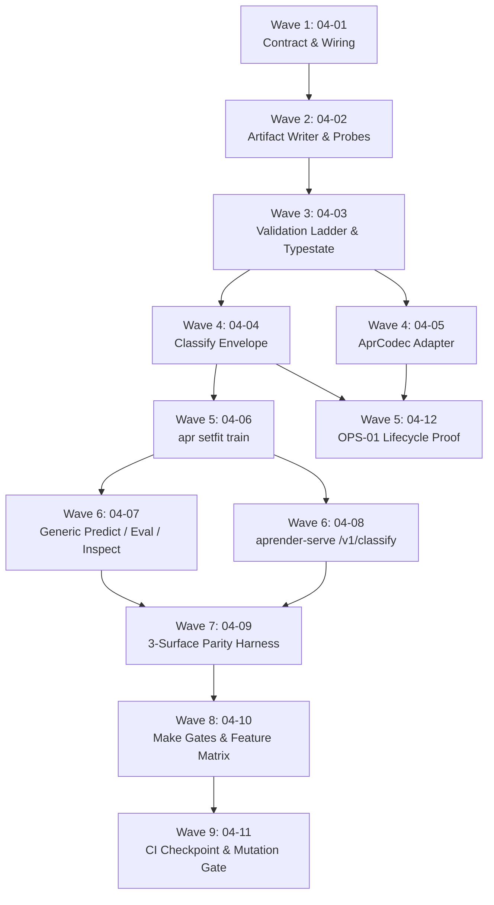

# Cross-AI Plan Review — Phase 4: APR Artifact and Production Parity

Two independent reviewers assessed all 12 plans across 9 waves. **They reached opposite
verdicts.** Gemini graded the phase A+ and recommended immediate execution; Codex graded it
HIGH risk and recommended a schema/API reconciliation pass before wave 2. The Consensus
Summary at the bottom reconciles the two.

Reviewer invocation notes:
- **Gemini** — via the `gemini` → `agy` shim (Antigravity CLI 1.1.13); Google retired the
  standalone gemini CLI. Exit 0.
- **Codex** — first invocation derailed: Codex loaded its own installed copy of the
  `gsd-review` skill and began recursively re-executing this very workflow instead of
  reviewing the plans. It was killed (the `--sandbox read-only` flag kept the repo clean)
  and re-run with `--ignore-user-config --ignore-rules` plus an anti-skill preamble. Exit 0.
  Only the second, clean run is recorded below.

---

## Gemini Review

### Cross-AI Plan Review: Phase 4 (APR Artifact and Production Parity)

### 1. Executive Summary & Verdict

| Category | Assessment | Score |
| :--- | :--- | :---: |
| **Plan Architecture & Sequencing** | Exceptional. Dependency graph across 9 waves eliminates race conditions; parallel waves have zero file overlap. | **9.8 / 10** |
| **Requirement Traceability** | Complete. All active requirements (APR-01..05, OPS-01..06, SAFE-01..02, TRN-07) mapped to testable behaviors. | **10 / 10** |
| **Verification & Anti-Regression Rigor** | Outstanding. Strict fail-closed design, typestate compile-fail proofs, cross-process determinism, and in-band negative fixtures. | **9.7 / 10** |
| **Edge-Case & Pitfall Mitigation** | Thorough. Specifically addresses nondeterministic `HashMap` metadata, float null-render bugs, and vacuous zero-match test filters. | **9.5 / 10** |
| **Overall Verdict** | **READY TO EXECUTE (Approved with minor operational advisories)** | **Grade: A+** |

The Phase 4 implementation plan is exceptionally well-researched, meticulously bounded, and strictly adheres to the project’s contract-first, test-driven philosophy. The decision to make `ClassifyResponse` a unified core type (D-08) and enforce loader integrity via the 7-rung validation ladder and probe replay (D-11) solves parity and security by construction.

---

### 2. Structural & Architectural Strengths

#### 1. Robust Determinism Architecture (D-01, D-02, Pitfalls 1 & 2)
- **Single-Key `custom` Serialization**: Replacing arbitrary top-level `HashMap` keys with a single `"setfit"` key storing a `serde_json::Map` (BTreeMap-backed) prevents random iteration ordering from invalidating container checksums across processes.
- **Byte-Exact Tokenizer Storage**: Embedding `tokenizer.json` as a raw `TensorDType::U8` tensor (`tokenizer.blob`) eliminates the lossy array-reconstruction bugs common in traditional metadata tokenizers.
- **Cross-Process Determinism Proofs (04-02 Task 2)**: Spawning a distinct child process (`SETFIT_APR_DETERMINISM_CHILD=1`) to assert hash equality validates true process-independent byte reproducibility.

#### 2. Typestate & Safety Guardrails (APR-04, SAFE-03)
- **`VerifiedSetFitModel` Private Typestate**: The loader is the *only* door to obtain a model with a `classify()` method.
- **Trybuild Compile-Fail Proof (04-03 Task 3)**: Validating via out-of-crate trybuild tests (`setfit_verified_model_constructed.rs`) ensures no external or downstream caller can forge an unverified model instance.
- **Execution-Derived Backend Identity (D-12)**: Reading SIMD/CPU execution details directly from `trueno` runtime detection rather than echoing user configuration prevents fraudulent capability claims.

#### 3. Wave Dependency Hygiene & Parallel Wave Safety
- **Relocation of 04-12 to Wave 5**: Moving the OPS-01 lifecycle proof to Plan 04-12 (Wave 5) correctly resolves the dependency on Plan 04-04’s `VerifiedSetFitModel::classify`, keeping Wave 4 (`04-04` vs `04-05`) completely decoupled across crate boundaries (`aprender-core` vs `aprender-train`).
- **Parallel Disjointness**:
  - **Wave 4**: `04-04` (`aprender-core`) ∥ `04-05` (`aprender-train`)
  - **Wave 5**: `04-06` (`apr-cli`) ∥ `04-12` (`aprender-train`)
  - **Wave 6**: `04-07` (`apr-cli`) ∥ `04-08` (`aprender-serve`)

---

### 3. Requirement & Decision Traceability Matrix

| Requirement | Description | Owning Plans | Key Mechanism / Verification Anchor |
| :--- | :--- | :--- | :--- |
| **APR-01** | Checksummed F32 `setfit-apr-v1` artifact | `04-01`, `04-02` | `AprV2Writer`, canonical names, U8 tokenizer blob, one-key metadata |
| **APR-02** | Fail-closed offline loader | `04-03` | 7-rung validation ladder, D-03 length cap check before parse |
| **APR-03** | Train→Save→Reload→Verify closure | `04-05` | `AprCodec` sealed adapter, `Tolerance::EXACT` round-trip comparison |
| **APR-04** | Consumer unverified rejection | `04-03`, `04-04` | `VerifiedSetFitModel` private constructor + trybuild non-constructibility |
| **APR-05** | Complete metadata inspection recovery | `04-03`, `04-07` | `doc_view()` accessors, `apr inspect` auto-detect recovery |
| **OPS-01** | Stable Rust library lifecycle API | `04-03`, `04-12` | `train -> save -> load -> embed -> classify -> inspect` test without CLI deps |
| **OPS-02** | `apr` CLI CPU lifecycle | `04-06`, `04-07` | `apr setfit train`, `apr predict`, `apr eval`, `apr inspect` |
| **OPS-03** | Generic command auto-detection | `04-07`, `04-08` | Explicit tag check (`model_type == "setfit"`), routing to core model |
| **OPS-04** | Enriched ClassifyResponse envelope | `04-04` | Single core `ClassifyResponse` struct, token/truncation facts, latency, backend ID |
| **OPS-05** | Native HTTP serving & readiness | `04-08` | `POST /v1/classify`, `AppState` slot, `/health/ready` artifact hash verification |
| **OPS-06** | CPU fallback & device fail-closed | `04-04`, `04-06` | `resolve_device` CudaNotAvailable hard error, execution backend detection |
| **SAFE-01** | Parity gate + contracts | `04-01`, `04-09` | 3-surface harness (in-proc lib, spawned CLI, axum oneshot), in-band negative |
| **SAFE-02** | CPU feature matrix in CI | `04-10`, `04-11` | 4-crate feature matrix (`--no-default-features`, `--features setfit`, all) |
| **TRN-07** | Positive selection-lock grant | `04-07`, `04-11` | `apr eval` lock -> mint token -> grant workflow |

---

### 4. Critical Risk Analysis & Recommendations

#### ⚠️ Risk 1: Float Serialization & Non-Finite Values (CR-03 Prevention)
* **Risk**: `serde_json` converts `f32::NAN` and `f32::INFINITY` into `null`. If non-finite values slip into probe records, embeddings, or logits, they will produce invalid JSON or corrupt round-trip validation.
* **Mitigation in Plan**: 
  - Storing float expectations in the artifact metadata using bit-pattern hex representations (`f32_to_hex`).
  - Strict NaN-visible comparisons (`matches!(delta.partial_cmp(&bound), Some(Less | Equal))`).
  - Pre-serialization validation in `write_setfit_apr` and `ClassifyResponse` that returns typed `NonFiniteValue` errors.
* **Recommendation**: Ensure that `within` comparison helper functions are unit-tested against `f32::NAN` to assert that they always return `false` on NaN comparisons.

#### ⚠️ Risk 2: Test Filter Vacuous Passes (CR-02 Prevention)
* **Risk**: In `cargo test`, a filter matching 0 tests exits with code 0, creating a false-positive passing gate.
* **Mitigation in Plan**: Every automated command in the plan requires asserting non-zero test counts (e.g. `grep -c "test result: ok."` or asserting `N passed >= K`).
* **Recommendation**: Standardize the Makefile helper macro or script wrapper that parses the `test result: ok. X passed; 0 failed` summary line to enforce `X > 0`.

#### ⚠️ Risk 3: Local Darwin/macOS Host Quirks
* **Risk**: As noted in Research Pitfall 6, `cargo check --workspace` fails on Darwin due to `aprender-profile`, `make tier2` has arm64 clippy red baselines in untouched crates, and incremental build directories can rapidly consume disk space.
* **Recommendation**: 
  - Strictly maintain `CARGO_INCREMENTAL=0` during heavy test execution waves.
  - Scope all clippy checks to touched crates (`-p aprender-core --features setfit`, `-p aprender-train --features setfit`, `-p apr-cli --features setfit`, `-p aprender-serve --features setfit`).

#### ⚠️ Risk 4: CI Workflow Modification Policy
* **Risk**: Modifying `.github/workflows/ci.yml` in autonomous mode violates project directives.
* **Mitigation in Plan**: Plan `04-11` explicitly isolates the CI change behind Task 1 (generate patch), Task 2 (blocking human checkpoint), and Task 3 (apply and audit after human approval).

---

### 5. Wave-by-Wave Assessment



1. **Wave 1 (`04-01-PLAN.md`)**: Perfect starting gate. Commits `contracts/setfit-apr-v1.yaml` with explicit constants (256 MiB cap, 6 probe strings, $7.63 \times 10^{-6}$ tolerances) and documents the `CLAUDE.md` `realizar-first` exception before writing code.
2. **Wave 2 (`04-02-PLAN.md`)**: Solid focus on byte-canonical serialization and cross-process determinism.
3. **Wave 3 (`04-03-PLAN.md`)**: Dual-door design (`load_setfit_apr` and `read_setfit_apr_parts`) ensures the 7-rung ladder is never duplicated between the runtime loader and the round-trip codec.
4. **Wave 4 (`04-04-PLAN.md` & `04-05-PLAN.md`)**: Clean parallelization across crates. `04-04` locks down envelope serialization while `04-05` seals the `AprCodec` adapter in `aprender-train`.
5. **Wave 5 (`04-06-PLAN.md` & `04-12-PLAN.md`)**: Delivers CLI training and end-to-end Rust library lifecycle proofs without circular dependencies.
6. **Wave 6 (`04-07-PLAN.md` & `04-08-PLAN.md`)**: Completes user-facing CLI and HTTP inference surfaces.
7. **Wave 7 (`04-09-PLAN.md`)**: Live 3-surface parity test (in-process Rust, spawned CLI, in-process HTTP via Tower `oneshot`) + in-band negative guarantees zero drift across surfaces.
8. **Wave 8 (`04-10-PLAN.md`)**: Hardens gates with non-vacuous ran-something assertions and full feature matrix coverage.
9. **Wave 9 (`04-11-PLAN.md`)**: Compliant CI extension checkpoint and mutation analysis.

---

### 6. Final Recommendation

**Proceed with execution starting at Wave 1 (`04-01-PLAN.md`).** The phase plans represent a masterclass in deterministic, contract-driven systems engineering.

---

## Codex Review

### Summary

The plan set is unusually thorough in contract discipline, negative testing, typestate enforcement, deterministic serialization, and cross-surface parity. Its wave structure is mostly coherent, and the intended architecture—core-owned artifact semantics and inference, a thin training codec, filesystem-only CLI adapters, and transport-only serving—fits the phase goals well. However, several load-bearing interfaces are internally inconsistent or underspecified: classifier-head persistence is missing from the tensor schema, the codec cannot obviously preserve all metadata required for byte-canonical closure, CLI evaluation has no persistent selection-lock workflow, backend reporting may describe detected hardware rather than executed computation, and the parity harness cannot carry the same multiline inputs through its CLI format. These are implementation-blocking design issues rather than ordinary coding details. The phase should not execute in its present form without a short schema/API reconciliation pass.

### Strengths

- The plans consistently enforce one production loader and one core classification path. This directly supports APR-02, OPS-03, and the “served model is the evaluated model” goal.

- `04-01-PLAN.md` correctly commits caps, tolerances, probe policy, tensor naming, and validation order before comparison code. This is strong protection against tests being tuned after observing results.

- The deterministic-serialization analysis in `04-02-PLAN.md` is excellent. The one-custom-key rule, absence of timestamps, cross-process testing, and pinned hash golden address realistic Rust `HashMap` nondeterminism.

- The ordered validation ladder in `04-03-PLAN.md` is well conceived, particularly the raw-size check, exact tensor-set validation, non-finite scan, tokenizer hash validation, and probe replay before minting `VerifiedSetFitModel`.

- Typestate and trybuild checks are used appropriately to make unauthorized construction difficult rather than merely documenting that it should not happen.

- The synthetic probe policy avoids embedding TweetEval text in shipped artifacts, an important licensing and privacy safeguard.

- `04-04-PLAN.md` centralizes the response envelope in core, preventing CLI and HTTP schema drift.

- `04-08-PLAN.md` keeps serving as transport and delegates tokenization, pooling, loading, and classification to core, respecting crate boundaries.

- `04-09-PLAN.md` combines live three-surface comparison, frozen goldens, and an in-band negative. This is a strong, falsifiable parity design.

- `04-10-PLAN.md` explicitly guards against zero-match test filters and unwired feature-gated code, applying lessons from earlier phases.

- The human checkpoint around CI policy in `04-11-PLAN.md` is directionally correct, and the closing audit requires evidence for each checked requirement.

### Concerns

- **HIGH — Classifier-head persistence is not actually specified.** `04-02-PLAN.md` requires “exactly the canonical F32 tensor set plus one U8 tokenizer” and describes writing canonical encoder tensors, but the artifact must also contain head weights and intercepts. `04-03-PLAN.md` later expects to rebuild the head from stored coefficients, yet neither the contract nor writer assigns canonical tensor names or storage entries for those coefficients. Metadata records head configuration, not necessarily the coefficient arrays. APR-01 and every classification path depend on resolving this.

- **HIGH — The metadata schema is inconsistent across plans.** `04-01` lists the one-key document fields without explicit architecture, head coefficients/configuration, root seed, or all provenance fields. `04-03` subsequently assumes the document contains architecture, root seed, and stored head coefficients. The exact normative `SetFitArtifactDoc` schema must be settled before writer implementation.

- **HIGH — Byte-canonical codec closure may be impossible with the proposed bundle seam.** `04-05-PLAN.md` requires `deserialize` to reconstruct a `SetFitBundle` from the APR and then reproduce identical bytes. The listed `SetFitBundle` fields do not clearly carry all planned artifact data, especially full provenance, the HF map, schema details, and embedded probe records. Recomputable probes are acceptable, but non-derivable metadata will be lost and break `serialize(deserialize(bytes)) == bytes`. This should be proven as a field-by-field bijection before implementation.

- **HIGH — The codec error mapping appears incompatible with the declared types.** `04-05` says to map `SetFitArtifactError` into `CodecError::Bundle { source: BundleError }` while modifying neither `bundle.rs` nor the error definitions. Unless an existing lossless conversion is already public, the prescribed implementation cannot preserve the typed source as claimed.

- **HIGH — `04-06` assumes access to a configuration wire type that is likely intentionally private.** Task 2 proposes deserializing into the wire struct, applying overrides, and converting through the validator. An external crate generally cannot access a private serde wire type. The plan needs a public validated override API, public builder, or a core/train-owned “merge and validate” function. That API work is not included in the file list or dependency graph.

- **HIGH — TRN-07’s CLI workflow is not persistently modeled.** `04-07-PLAN.md` says canonical test evaluation creates a selection lock, mints a token, grants access, and also refuses test evaluation without a prior validation lock. A separate `apr eval --split test` process has no specified lock input or durable validation-selection record, while creating the lock during the test command would defeat the “created before test access” requirement. The CLI needs an explicit lock artifact lifecycle: validation emits a lock file; test evaluation requires and verifies that file.

- **HIGH — Backend identity may still be intent or capability, not execution evidence.** `04-04` proposes reporting trueno’s runtime CPU feature detection. Detecting AVX2/NEON availability does not prove that the SetFit encoder operation actually used that backend; the encoder may use a different implementation or scalar path. D-12 requires identity from the operation that ran, so the compute path must return execution provenance or the response must conservatively report the actual SetFit implementation/backend.

- **HIGH — Artifact size checks happen after callers may have allocated the entire hostile file.** The core loader accepts `&[u8]`, while predict, eval, and serve plans use `read file bytes -> load_setfit_apr`. A multi-gigabyte file can exhaust memory before the 256 MiB loader cap executes. CLI and serving adapters need metadata-length checks and bounded reads before `fs::read`, or a bounded reader/file-loading API in core.

- **HIGH — The response’s “non-finite values are unrepresentable” claim conflicts with public serde structs.** `04-04` derives `Serialize + Deserialize` and appears to expose ordinary fields required by consumers and parity tests. Public fields or derived deserialization allow construction without the validating constructor. Later, `04-09` mutates a cloned response to make a skewed negative. The design must choose private fields with accessors and custom validated deserialization, or weaken the claim to “the production classify path validates before serialization.”

- **HIGH — The parity harness does not preserve identical multiline input.** `04-09` includes a whitespace/newline probe but sends CLI input as “one text per line.” A single text containing `\n` becomes multiple CLI texts, so the three surfaces do not receive the same ordered input set. Use JSON input, JSONL with explicit string escaping, length framing, or repeated arguments that preserve embedded newlines.

- **MEDIUM — Typed metadata decisions do not fully match D-02.** The locked decision calls for well-known typed keys for family, schema, schema version, labels, and tokenizer hash. The plans appear to use only `model_type` as a typed field and place the rest under one custom document. If the APR container cannot represent additional typed keys, this must be recorded as an explicit amendment rather than silently changing D-02.

- **MEDIUM — `04-08` has contradictory missing-model route behavior.** Task 1 installs `/v1/classify` only when the model slot is populated, but Task 3 expects the route to return 503 when no SetFit model is present. Conditional route installation would normally produce 404. Install the route whenever the feature is enabled and let the handler return 503, or change the contract and tests consistently.

- **MEDIUM — There is no complete spawned CLI lifecycle proof for OPS-02.** Training, inspect, eval, and predict are tested separately, but no plan drives the actual binary through `train -> inspect -> validation lock -> test eval -> predict` using the outputs of preceding commands. Given the unresolved lock persistence and CLI wiring risks, a single end-to-end lifecycle test is warranted.

- **MEDIUM — Generic APR tooling compatibility is assumed rather than tested.** D-01 explicitly intends `apr tensors/qa/diff` to work unmodified with canonical names and a U8 tokenizer entry. Research flags this as assumption A3, but no plan tests those tools against the produced artifact. A U8 pseudo-tensor may expose numeric-only assumptions.

- **MEDIUM — The “tiny fixture” may conflict with a schema fixed to the pinned six-layer architecture.** `04-02`, `04-03`, `04-08`, and `04-09` repeatedly use a tiny fixture while enforcing an exact canonical tensor set derived for pinned MiniLM. The plans must define whether the fixture retains the exact six-layer/name topology with reduced dimensions or whether test-only architectures are allowed. A test-only schema exception would weaken the production contract.

- **MEDIUM — Some Make commands are syntactically or operationally questionable.** In `04-10`, a command such as `cargo test ... setfit::artifact:: setfit::classify::` supplies two positional test filters, while Cargo normally accepts one filter. The CLI target similarly refers to multiple filters without defining separate invocations. Each suite should be a separate command with its own result and nonzero-run guard.

- **MEDIUM — SAFE-02’s feature matrix is incomplete as written.** The stated matrix includes no-default, `setfit`, and all-features profiles. `04-10` adds feature-on/off checks for CLI and serve but does not clearly add all-features test/build legs for all four crates, nor runtime test legs for every matrix point.

- **MEDIUM — `04-10` edits a contract outside its declared file list.** Task 2 permits changing binding statuses in `contracts/setfit-apr-v1.yaml`, but the plan declares only `Makefile` under `files_modified`. This breaks the otherwise careful file-ownership and audit model.

- **MEDIUM — Spawned-server port selection is underspecified.** `127.0.0.1:0` cannot be used by the parent unless the chosen port is communicated, while a fixed high port is collision-prone. `04-09` needs a reliable port-reservation/handoff protocol and bounded child-output handling.

- **MEDIUM — The CI checkpoint still modifies the workflow before approval.** `04-11` Task 1 calls for a prepared working-tree edit, then says the workflow has not been “applied.” Under a strict check-in-before-acting rule, editing the workflow is already acting. Prepare and present a textual patch first; apply it to the working tree only after approval.

- **MEDIUM — Mutation testing across several crates in one invocation may not work as assumed.** `04-11` supplies file globs spanning multiple packages without an explicit package/workspace strategy. Cargo-mutants commonly operates in a selected package context. Split the mutation run by crate, report separate baselines, and calculate the aggregate adjusted score explicitly.

- **LOW — The cap boundary test is unnecessarily expensive.** `04-03` allocates `cap + 1` bytes, roughly 256 MiB, for a unit test that only needs to prove pre-parse length handling. Expose a limit-injected internal helper for tests or use a small test limit.

- **LOW — Latency assertions may be flaky.** `04-09` requires `latency_ms > 0`; fast operations and timer resolution can produce zero. Require finite and non-negative latency instead.

- **LOW — Exact `token_count == 256` may bind to tokenizer implementation details.** Depending on whether special tokens are counted, the externally meaningful invariant may be `truncated == true` and an attention-mask length of 256 rather than a specific semantic token count.

### Suggestions

- Add a schema reconciliation task before `04-02`. Define a single table mapping every APR-01 item to its storage location, Rust source field, canonical serialization representation, and loader destination. Include encoder tensors, head weights/intercepts, tokenizer bytes, architecture, labels, configs, evidence, provenance, probes, and hashes.

- Give head tensors explicit canonical names and structural rules, such as versioned SetFit-specific names for classifier weights and bias. Test generic `apr tensors`, `qa`, and `diff` against both F32 head tensors and the U8 tokenizer entry.

- Prove the codec bijection on paper and in types: every serialized document field must either exist in `SetFitBundle` or be a deterministic function of bundle fields. If provenance is missing, extend the trusted bundle before implementing the writer.

- Add public train-owned APIs for config override/validation and verified-run reconstruction rather than having apr-cli access private wire or lifecycle internals.

- Redesign `apr eval` around a durable selection-lock artifact. Validation should atomically write it; test evaluation should require `--selection-lock`, verify its artifact/data/candidate hashes, and refuse absent, stale, or mismatched locks.

- Introduce bounded file loading shared by CLI and serve: inspect file length first, reject over-cap files, then read at most `cap + 1` bytes. Preserve the loader’s in-memory cap as defense in depth.

- Make execution backend provenance an output of the actual encoder/compute invocation. If that is unavailable in v1, report a conservative identifier such as `cpu:setfit-core:<kernel>` rather than the best available SIMD capability.

- Make response fields private and construct them through validated constructors; implement custom `Deserialize` if HTTP/test deserialization is required. Let parity negatives operate on a separate comparison fixture or deliberately unchecked test representation.

- Use a JSON request format for CLI batch prediction so embedded newlines, tabs, empty strings, and Unicode survive identically across library, CLI, and HTTP surfaces.

- Add one spawned binary-level OPS-02 lifecycle test that consumes outputs from preceding commands, including the persisted validation lock.

- Correct `04-08` route semantics: either always register `/v1/classify` under the feature and return 503 without a model, or specify 404 consistently.

- Split Make filters into valid individual Cargo invocations, each with its own ran-something guard. Extend the four-crate matrix to explicitly cover no-default, setfit-only, and all-features profiles as supported.

- Present the CI edit as a textual patch before touching `.github/workflows/ci.yml`, then apply exactly the approved patch.

### Risk Assessment

**Overall risk: HIGH.**

The overall architecture and validation philosophy are strong, but several issues affect the phase’s core correctness: the artifact does not yet have an unambiguous place for classifier coefficients; writer, loader, and codec disagree about the normative metadata fields; the codec may not be able to reproduce all artifact bytes from `SetFitBundle`; and the proposed canonical-test CLI flow does not persist the prerequisite selection lock. In addition, backend identity and hostile-file bounds do not yet meet their stated security claims. These problems are fixable without abandoning the architecture, but they require revising the contract and public API boundaries before wave 2 begins.

---

## Consensus Summary

The two reviewers agree almost completely about **what the plans are trying to do** and
disagree almost completely about **whether the plans currently specify it well enough to
build**. Gemini reviewed the phase as an architecture and found it excellent. Codex reviewed
it as a set of interface contracts and found several load-bearing seams unspecified or
mutually inconsistent. Both readings are internally consistent, which is why the divergence
is informative rather than noise: they are answering different questions.

Where they overlap, that overlap is high-confidence. Where Codex found HIGH issues that
Gemini's traceability matrix scored as complete, Codex went a level deeper — it checked
whether the field actually exists in the named struct, not merely whether a plan claims to
own the requirement. Those findings should be treated as the actionable core of this review.

### Agreed Strengths

Raised independently by both reviewers:

- **Contract-before-code sequencing (04-01).** Committing caps, tolerances, probe policy,
  tensor naming, and validation order before any comparison code exists prevents tests from
  being tuned after observing results. Both called this out as the correct starting gate.
- **Deterministic serialization design (04-02).** The single-`"setfit"`-custom-key rule
  (BTreeMap-backed, avoiding `HashMap` iteration nondeterminism), the absence of timestamps,
  the cross-process child-process determinism proof, and the pinned hash golden.
- **The ordered 7-rung validation ladder (04-03)**, especially the raw-size check before
  parse, exact tensor-set validation, non-finite scan, tokenizer hash check, and probe replay
  before the model becomes usable.
- **Typestate enforcement via `VerifiedSetFitModel` plus trybuild compile-fail proofs** —
  making unverified construction impossible rather than merely documented as forbidden.
- **Centralizing `ClassifyResponse` in core (04-04)** to prevent CLI/HTTP schema drift.
- **The three-surface parity harness with frozen goldens and an in-band negative (04-09)** as
  a falsifiable design rather than a smoke test.
- **Non-vacuous test gates (04-10)** — explicitly guarding against zero-match `cargo test`
  filters that exit 0 and produce false-green gates.
- **Byte-exact tokenizer storage as a U8 tensor blob**, avoiding lossy array reconstruction.
- **Synthetic probes rather than embedded TweetEval text** (Codex additionally flagged this as
  a licensing/privacy safeguard, not just a determinism one).

### Agreed Concerns

Raised by both, and therefore highest priority:

- **The Make gate commands in 04-10 are not yet trustworthy.** Gemini asked for a standardized
  wrapper that parses `test result: ok. X passed` and enforces `X > 0`. Codex went further and
  found a concrete defect: commands such as `cargo test ... setfit::artifact:: setfit::classify::`
  pass *two* positional filters, which Cargo does not accept as written. Both conclude each
  suite needs its own invocation with its own ran-something guard.
- **Non-finite float handling is not fully closed.** Gemini wants the `within` comparison
  helpers unit-tested against `f32::NAN` to prove they return false. Codex raised the stronger
  form: `ClassifyResponse` derives `Serialize + Deserialize` with accessible fields, so the
  claim that non-finite values are *unrepresentable* is not enforceable — a value can be
  constructed bypassing the validating constructor (and 04-09 deliberately does exactly that
  to build its skewed negative). Either make fields private with custom validated
  `Deserialize`, or weaken the claim to "the production classify path validates before
  serialization."
- **The CI checkpoint in 04-11 needs care.** Both engaged with it; see Divergent Views for how
  they split.

### Divergent Views

Worth investigating — the reviewers read the same mechanism in opposite ways:

- **Overall readiness.** Gemini: "Proceed with execution starting at Wave 1 … a masterclass in
  deterministic, contract-driven systems engineering." Codex: "The phase should not execute in
  its present form without a short schema/API reconciliation pass." Note that Gemini's review
  is uniformly laudatory with only operational advisories, which is weak evidence of adversarial
  scrutiny; Codex's findings are specific and falsifiable. Prefer the specific claims.
- **Backend identity (D-12) — direct contradiction.** Gemini praised "execution-derived backend
  identity … reading SIMD/CPU execution details directly from trueno runtime detection rather
  than echoing user configuration" as *preventing* fraudulent capability claims. Codex argued
  the same mechanism *is* the fraudulent claim: detecting that AVX2/NEON is available does not
  prove the SetFit encoder used it, since the encoder may take a scalar path. This maps
  directly onto the project's own verification rule "never label a run by intent — prove the
  mechanism engaged." **Codex is almost certainly right here**, and this is the single most
  consequential disagreement in the review.
- **Requirement traceability.** Gemini scored traceability 10/10 with every requirement mapped.
  Codex found that APR-01 has no resolved storage for classifier head weights and intercepts:
  04-02 specifies "canonical F32 tensor set plus one U8 tokenizer," 04-03 expects to rebuild the
  head from stored coefficients, and no plan assigns canonical tensor names to those
  coefficients. A requirement can be *assigned to a plan* (Gemini's check) while still being
  *unimplementable as specified* (Codex's check).
- **Wave/file-ownership hygiene.** Gemini called the dependency graph exceptional with zero file
  overlap in parallel waves. Codex found two leaks in that model: 04-10 Task 2 edits
  `contracts/setfit-apr-v1.yaml` while declaring only `Makefile` in `files_modified`, and 04-06
  requires a public config-override/validation API that appears in neither the file list nor the
  dependency graph.
- **CI checkpoint.** Gemini judged 04-11 compliant because the change is isolated behind a human
  checkpoint. Codex judged it non-compliant because Task 1 prepares a working-tree edit to
  `.github/workflows/ci.yml` *before* approval, and under a strict check-in-before-acting rule
  editing the file is already acting. Codex's reading matches this repo's stated policy — present
  a textual patch first, apply only after approval.

### Recommended Disposition

Codex's HIGH findings cluster into four pre-wave-2 blockers, none of which require abandoning
the architecture:

1. **Schema reconciliation** — one normative table mapping every APR-01 item to storage
   location, Rust source field, serialized representation, and loader destination. Resolves the
   head-persistence gap, the writer/loader/codec metadata disagreement, and the `SetFitBundle`
   round-trip bijection question in 04-05.
2. **Public API surface for 04-06** — a train-owned validated config-override API, since
   apr-cli cannot reach a private serde wire type from another crate.
3. **Durable selection-lock artifact for TRN-07** — validation writes a lock file; `apr eval
   --split test` requires and verifies it. As written, a separate test-eval process has no lock
   input, and minting the lock inside the test command defeats the requirement.
4. **Bounded file reads before `fs::read`** in CLI and serve adapters — the 256 MiB cap
   currently runs *after* the caller has already read a potentially multi-gigabyte hostile file
   into memory.

Plus the D-12 backend-identity correction above, which is a claims-integrity issue rather than
a schedule issue.

### How to use this review

```
/gsd:plan-phase 4 --reviews
```
