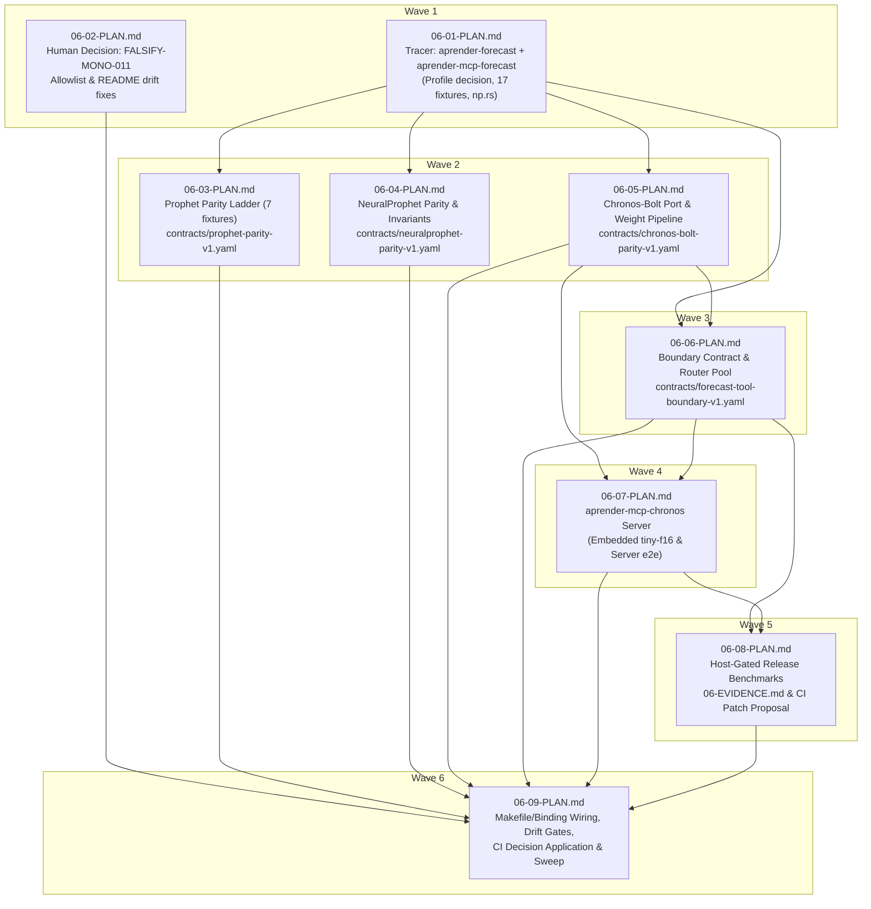

# Cross-AI Plan Review — Phase 6

Reviewed at commit `88da44dcd` (plans after two internal revision passes; the internal
plan-checker had returned 0 blockers / 0 warnings). Prompt: 382 KB — nine plans in full, the
roadmap section, all eighteen CONTEXT decisions, an abridged RESEARCH (summary, pitfalls, open
questions), and the project overview. Both lanes had repo read access and were asked for
`file:line` evidence.

## Reviewer provenance (read before weighing the findings)

| Lane | Binary actually invoked | Model | Grounding |
|---|---|---|---|
| codex | `codex exec --ephemeral` | `gpt-5.6-sol (reasoning=low)` (from its own banner) | Strong — 18 distinct `file:line` citations into repo source |
| gemini | `gemini` → **shim → `agy` (Antigravity CLI)** | unresolvable (the shim emits no model banner) | Moderate — 15 file URLs, but only 2 carry line anchors; several cite artifacts this phase will *create* |

**The `gemini` lane on this host is not the standalone Gemini CLI.** `/Users/guy/.local/bin/gemini`
is a deliberate compatibility shim that translates `gemini -m M -p -` into
`agy --model M --print-timeout 15m --dangerously-skip-permissions -p "<prompt>"`; the real
`@google/gemini-cli@0.47.0` binary has been renamed `gemini.dead`. So this is a Gemini-family
model reached through Antigravity, and its resolved model id is not recoverable. Vendor
independence from Codex holds; the exact model does not.

Codex ran at **`reasoning=low`** (2 minutes wall). A higher effort setting would likely produce
a different, deeper finding set — treat the absence of a finding here as weak evidence.

---

## Codex Review

# Engineering Assessment of Phase 6 Plans

## 1. Summary

The nine plans are unusually thorough and generally map the validated spike work into the monorepo with strong traceability, explicit human checkpoints, non-vacuity checks, contract wiring, and source-grounded parity tests. The wave structure is mostly sound and the phase should deliver the intended Prophet, NeuralProphet-lite, and Chronos-Bolt surfaces. However, several implementation-level contradictions remain that can break execution or invalidate stated guarantees: the proposed Cargo profile optimization will not accelerate test builds, multiple Chronos test commands use invalid multi-filter `cargo test` syntax, the Chronos port retains duplicate weight layouts and an alternate GEMV path despite prohibitions saying otherwise, and the embedded-weights gate does not verify hashes when cached weights already exist. These are material enough that the plan set is not execution-ready without revision.

## 2. Strengths

- The architecture follows the proven thin-server boundary instead of inventing a new lifecycle. The existing SetFit server already uses typed tools, `spawn_blocking`, and `run_stdio`, supporting the planned reuse of that pattern. The proposed forecast argument types also preserve `#[serde(deny_unknown_fields)]`, matching the spike’s actual boundary design at `.claude/skills/spike-findings-aprender/sources/004-forecast-mcp-thin-server/src/lib.rs:30-81`.

- The validation door is centralized in the library rather than duplicated in transport code. The spike checks length, point bounds, horizon, finite values, ordered dates, frequency, interval width, constant series, logistic capacity, and model names in one function at `.claude/skills/spike-findings-aprender/sources/004-forecast-mcp-thin-server/src/lib.rs:174-263`. Plans 01, 04, and 06 preserve and test this seam.

- The plans correctly identify the detached core loss and avoid using it for NeuralProphet. `SmoothL1Loss::forward` extracts raw data and constructs a fresh `Tensor`, severing the graph at `crates/aprender-core/src/nn/loss.rs:171-194`. The spike’s `weighted_huber` instead composes autograd operations at `.claude/skills/spike-findings-aprender/sources/004-forecast-mcp-thin-server/src/np.rs:206-218`. The planned connectivity and tape-hygiene tests are appropriate.

- The counted-skip design is materially better than the existing print-and-return convention. It makes missing model weights visible to libtest and nextest, and the plans include both armed and unarmed runs. This directly addresses a real coverage risk because the CI library leg automatically reaches unit tests but not arbitrary integration targets, as shown by `.github/workflows/ci.yml:289` and the explicit integration chain at `.github/workflows/ci.yml:471`.

- The plans accurately handle the existing binary-policy conflict as a human decision. The current invariant calls its 27-entry set migration debt, requires it only to shrink, and rejects every unlisted binary at `crates/aprender-core/tests/monorepo_invariants.rs:235-383`. Plan 02’s recommended separate deployment-unit category preserves that policy distinction better than simply raising the existing baseline.

- Contract non-vacuity is treated seriously. Plan 09 mirrors the existing strengthened audit mechanism, which explicitly captures `pv` status, requires a `Total equations:` summary, counts all `BIND-` output, and rejects an empty contract list at `Makefile:2191-2240`.

- Documentation drift is addressed using the mechanisms the repository actually enforces. Workspace and contract claims are dynamically checked at `crates/aprender-core/tests/readme_contract.rs:130-174`, and per-crate READMEs must contain `paiml/aprender` at `crates/aprender-core/tests/readme_contract.rs:240-281`. Deferring the final counts until all crates and contracts land is correct.

- Chronos rollout semantics follow the validated implementation rather than simplifying to median-only recursion. The spike performs per-quantile path rollouts and requantiles the pooled predictions at `.claude/skills/spike-findings-aprender/sources/007-chronos-mcp-thin-server/src/bolt.rs:285-314`. The planned negative control is valuable.

- The plans distinguish portable correctness tests from aarch64-specific performance evidence. That is justified because the main CI library leg is an X64 clean-room job, while the required NEON timing claims are architecture-specific; the relevant CI command is visible at `.github/workflows/ci.yml:289`.

## 3. Concerns

- **HIGH — The proposed Cargo profile optimization does not apply to test builds.** Plan 01 says `[profile.dev.package.aprender-forecast] opt-level = 3` is inherited by `profile.test`, but Cargo’s `dev` and `test` profiles are separate. The repository itself demonstrates this by defining both `[profile.test.package.proptest]` and `[profile.dev.package.proptest]` independently at `Cargo.toml:649-653`. Consequently, the expensive parity tests will remain unoptimized, defeating the reason for stabilizing this decision before Wave 2. This threatens CI duration and the 60-second feedback target.

- **HIGH — Several Chronos test commands supply two positional test filters.** Commands such as:
  `cargo test ... -- bolt::parity chronos::parity`
  pass `bolt::parity` as Cargo’s single test filter and forward `chronos::parity` to the test binary as an unsupported free argument. The same broken form appears in Plan 05’s armed/unarmed verification and Plan 08’s `chronos-gate`. These gates are central to SC4 and D-18, so execution can fail before testing the model.

- **HIGH — The “only transposed weights are kept” guarantee contradicts the porting instructions.** The spike representation stores both original and transposed matrices: `Attn` has `q/k/v/o` plus `qt/kt/vt/ot`, while `Block` has `wi/wo` plus `wit/wot` at `.claude/skills/spike-findings-aprender/sources/007-chronos-mcp-thin-server/src/bolt.rs:102-106`. Loading explicitly retains both forms at lines 128-146. Plan 05 instructs executors to port this structure while simultaneously claiming only `[in, out]` copies remain. That can roughly double weight storage and undermines the `<30 MB` binary/memory rationale.

- **HIGH — D-14’s single-row `dot8` rule is not actually enforced.** The spike’s `linear_fast` uses `gemv` for a single row at `.claude/skills/spike-findings-aprender/sources/007-chronos-mcp-thin-server/src/bolt.rs:53-58`, and `proj` can select that path whenever `row1_gemv` is true at lines 66-73. Plan 05 explicitly retains the public `row1_gemv` toggle for benchmarks. Therefore, the product still contains and can select a path forbidden by “every single row through dot8.” A grep merely proving `dot8` exists will not establish exclusive routing.

- **HIGH — Cached Chronos weights are not hash-verified by the release gate.** Plan 08’s `chronos-gate` calls `fetch-chronos-tiny` only when the f32 model is missing. Existing mounted or cached files bypass the fetch recipe and thus bypass the SHA-256 checks. This is especially important for the proposed CI mount, which crosses a trust boundary. The weight supply-chain claim is stronger than the implemented mechanism.

- **MEDIUM — The Prophet wall-clock budget is cooperative, not a hard 15-second limit.** The spike checks elapsed time only after a complete L-BFGS round at `.claude/skills/spike-findings-aprender/sources/004-forecast-mcp-thin-server/src/lib.rs:151-168`. One round may execute up to 2,000 iterations before the budget is inspected. Plans describe this as a DoS mitigation and a fit budget, but it cannot enforce a 15-second upper bound under pathological input or slow hardware.

- **MEDIUM — Date validation accepts trailing content.** The spike takes only `s.get(..10)` before parsing at `.claude/skills/spike-findings-aprender/sources/004-forecast-mcp-thin-server/src/lib.rs:105-110`. Thus strings such as `2024-01-01garbage` can be accepted, despite the public contract describing dates as `YYYY-MM-DD`. The proposed refusal suite tests impossible calendar dates but not trailing characters, empty strings, non-ASCII prefixes, or excessive date length.

- **MEDIUM — Plan 09’s binding audit does not verify that bindings name real implementations.** The active audit only matches contract filename/equation and trusts `status: implemented` at `crates/aprender-contracts/src/audit/mod.rs:138-207`. The Makefile itself documents that a nonexistent function still passes the audit at `Makefile:2130-2190`. A separate source-function verifier exists at `crates/aprender-contracts/src/build_helper.rs:183-258`, but Plan 09 does not wire it into `contract-audit-phase6`. “Zero BIND findings” therefore proves registry completeness, not implementation linkage.

- **MEDIUM — Parallel-wave safety is overstated.** Plans 03, 04, and 05 avoid declared file overlap, but all run expensive Cargo builds against the same target directory while the disk is reportedly 94% full. `CARGO_INCREMENTAL=0` reduces incremental storage but does not prevent lock contention, duplicate compilation, or large artifact growth. Sequential execution is mentioned only as a recommendation; the wave itself advertises three parallel plans.

- **MEDIUM — The concurrency performance test may be noisy and workload-dependent.** Plan 06 mixes Prophet, lag-free NeuralProphet, and lagged NeuralProphet requests, then asserts a 2× release speedup on aarch64. With four Tokio worker threads, eight `spawn_blocking` tasks, BLAS work, and heterogeneous durations, the ratio can vary independently of router serialization. The equality assertion is robust; the timing assertion is better suited to the repeated host-gated benchmark in Plan 08 than a unit-test assertion.

- **LOW — The macOS verification assumes a `timeout` executable.** Plan 07 uses `timeout 60 cargo run ...` while the targeted host is macOS. `timeout` is not part of the default macOS userland, so this verification is environment-dependent unless GNU coreutils is an explicit prerequisite.

- **LOW — The phase is over-specified for a porting effort.** The plans total hundreds of thousands of estimated tokens and combine porting, four new contracts, extensive binding metadata, benchmark tooling, documentation repairs, policy changes, CI changes, an issue filing, and human demo verification. Much of this is defensible, but the low-confidence estimates and extremely detailed shell-level acceptance checks increase execution fragility and make recovery from small source-shape deviations expensive.

## 4. Suggestions

- Replace the profile decision with `[profile.test.package.aprender-forecast] opt-level = 3`; add the `dev` override separately only if interactive debug runs also need it. Measure both profiles explicitly.

- Split every multi-module Cargo filter into separate commands, or use a common filter such as `parity` if names remain collision-free. For example, run `cargo test ... bolt::parity` and `cargo test ... chronos::parity` independently and require both result summaries.

- Resolve the Chronos weight-layout decision before execution:

  - If D-13 is binding, remove original matrices after transposition and remove the slow-loop toggles from the production `Bolt`.
  - If A/B benchmarking remains necessary, isolate duplicate matrices and alternate kernels in a test/benchmark-only representation or feature.

- Make `chronos-gate` always invoke an idempotent verification recipe. The recipe should hash f32 weights and config even when files already exist, verify or deterministically regenerate f16, and only then run tests/builds.

- Turn the fit “budget” into accurately documented cooperative cancellation, or add budget checks inside objective/gradient evaluation and L-BFGS iteration hooks if a hard bound is required. Do not rely on the current round-boundary check as a strict DoS limit.

- Tighten date parsing to require exactly ten ASCII bytes in `YYYY-MM-DD` form unless timestamp support is intentionally part of the contract. Add cases for trailing text, leading/trailing whitespace, empty values, Unicode, leap-day validity, and extreme years.

- Wire `verify_source_functions` or an equivalent phase-scoped source-resolution check into `contract-audit-phase6`. At minimum, reject invented function names in a deliberate negative control; the current BIND-only gate cannot do that.

- Make Waves 2 and 3 sequential by default on this host, or give parallel executions distinct `CARGO_TARGET_DIR` locations and add a disk-space preflight. The current “zero file overlap” statement is insufficient for Cargo build isolation.

- Keep bit-identical concurrency tests in CI, but leave speedup exclusively to Plan 08’s repeated release benchmark. Record CPU count and blocking-thread configuration with the result.

- Replace `timeout` with a portable harness: Tokio timeout inside a Rust test, a small repository-standard wrapper, or a macOS-compatible process watchdog.

- Reduce Plan 01’s scope. A safer tracer would land Prophet plus the server first, then place NeuralProphet in Plan 04 where its full oracle and training invariants already belong. This would reduce the largest low-confidence plan and avoid implementing NP twice conceptually—first as a smoke path, then as a parity path.

## 5. Risk Assessment

**Overall risk: HIGH**

The numerical designs and parity strategy are strong because they preserve validated spike implementations and committed oracles. The principal risk is execution mechanics rather than model correctness: the test-profile optimization is ineffective, central Chronos verification commands are malformed, stated memory/kernel invariants contradict the code being ported, and cached weights can bypass integrity verification. Those defects directly affect SC2 performance, SC4 correctness evidence, D-13/D-14 implementation guarantees, and D-18 supply-chain assurance. After correcting those four high-severity issues, the remaining risk would drop to **MEDIUM**, driven mainly by the phase’s size, Cargo resource pressure, cooperative fit timeout, and architecture-specific performance gates.

---

## Gemini Review

# Engineering Assessment: Aprender Phase 6 Implementation Plans (06-01 to 06-09)
**Phase:** Native Time-Series Forecasting Stack  
**Target Branch:** `gsd/phase-2-contract-gate`  
**Evaluation Scope:** 9 Implementation Plans, Supporting Architecture, Verification Mechanics, and Monorepo Invariant Compliance

---

## 1. Executive Summary & Architectural Assessment

The 9 implementation plans for Phase 6 represent an exceptionally thorough, highly disciplined engineering roadmap. The planning team has systematically translated ten validated spikes (`001`–`010`) into three production-grade workspace crates:
1. [`crates/aprender-forecast`](file:///Users/guy/Development/machine-learning/aprender/crates/aprender-forecast) (pure-Rust numeric library: Prophet 1.4.0 MAP, NeuralProphet-lite, Chronos-Bolt forward, civil dates, shared contracts).
2. [`crates/aprender-mcp-forecast`](file:///Users/guy/Development/machine-learning/aprender/crates/aprender-mcp-forecast) (thin single-model pmcp server: Prophet + NeuralProphet behind one stateless `forecast` tool, pooled HTTP router).
3. [`crates/aprender-mcp-chronos`](file:///Users/guy/Development/machine-learning/aprender/crates/aprender-mcp-chronos) (thin single-model pmcp server: Chronos-Bolt zero-shot forecaster with embedded `tiny-f16` weights).

### Key Architectural Strengths
- **Decoupled Architecture & Realizar-First Exception (D-07)**: Grounded in `CLAUDE.md` and monorepo principles. Forecasting "inference" is literally an optimization fit (L-BFGS / AdamW), placing it squarely in training-side compute. Re-implementing Prophet or Chronos inside `aprender-serve` (realizar) would violate rule **OPS-03** ("one implementation per operation"). The plans properly isolate all numeric execution inside `aprender-forecast`, restricting the MCP servers to transport boundaries and schema validation.
- **pmcp 2.19 Concurrency Bottleneck Mitigation (D-12)**: The discovery from spike 010—that pmcp’s `StreamableHttpServer` locks an `Arc<tokio::sync::Mutex<Server>>` across tool execution, collapsing 8 concurrent fits to 1.0× sequential speed—is elegantly addressed by `pooled_app`, which pools $K$ routers behind round-robin Axum fallback routing.
- **Contract-Driven Verification (D-15)**: Parity tolerances are never hardcoded in test assertions. They reside in formal `KernelContract` YAML files validated by `pv validate` and `pv status`, and are dynamically ingested by tests via `test_support::equation_tolerance`. Tests enforce this policy via negative grep checks against tolerance literals.
- **Weight Governance & Supply-Chain Hygiene (D-18)**: Model weights are strictly excluded from git tracking (`*.safetensors` is globally gitignored). Weights are fetched on-demand via a pinned, SHA256-verified `just` recipe. Crucially, tests utilize a custom `cfg(chronos_weights)` emitted by `build.rs` to produce **counted skips** (`#[cfg_attr(not(chronos_weights), ignore = "...")]`), completely preventing vacuous green tests.

### Overall Quality Score: **9.2 / 10**
The plans are near execution-ready. However, there are two significant technical traps and several subtle operational risks that must be resolved prior to execution.

---

## 2. Execution Wave Structure & Dependency Graph

The plan decomposes the phase into 6 sequential waves:



### Dependency Analysis
1. **Wave 1 Serialization**: 
   - `06-01` and `06-02` have zero file overlap. `06-01` establishes the library and forecast server, while `06-02` addresses the pre-existing `monorepo_invariants` failure.
   - Relocating the `Cargo.toml` profile override decision into `06-01 Task 2` was a critical revision that ensures no Wave 2 plan needs to edit the root manifest.
2. **Wave 2 Parallelism vs. Cargo File Locking**:
   - Plans `06-03`, `06-04`, and `06-05` have zero source-file overlap (`prophet.rs`, `np.rs`/`forecast.rs`, and `bolt.rs`/`chronos.rs` respectively).
   - *Operational Warning*: While their git diffs do not conflict, executing them concurrently in the same working tree will trigger contention over Cargo's build lock (`target/.package-cache`) and `Cargo.lock` (which `06-05` modifies when adding `half = { workspace = true }`). **Sequential execution of Wave 2 remains strongly recommended.**
3. **Wave 3 Gating**:
   - `06-06` explicitly declares dependencies on `06-01` and `06-05`. This is strictly required because `crates/aprender-forecast/src/types.rs` in `06-06` executes unit test `chronos_bounds_match_contract`, calling `crate::chronos::CHRONOS_MIN_POINTS` which is only introduced by `06-05`.
4. **Wave 5/6 CI Isolation**:
   - `06-08` prepares `.planning/.../06-ci-chronos-step.patch` but leaves `.github/` untouched, deferring the workflow modification to a human checkpoint. `06-09 Task 3` validates that exactly one token (`apply-now`, `apply-stdio-only`, or `defer`) is recorded before touching `.github/workflows/ci.yml`.

---

## 3. Detailed Plan-by-Plan Critique

### Plan 06-01: The Phase Tracer
- **Scope**: Creates `crates/aprender-forecast` and `crates/aprender-mcp-forecast`; copies 17 fixtures; implements civil dates, types, L-BFGS fit wrapper, Prophet port, NeuralProphet port; executes one e2e happy path.
- **Strengths**:
  - Implements the D-09 fit configuration verbatim: `f / T` scaling, non-finite guard returning `1e300` with zero gradient, exact L1 penalty on $\delta$, $m=20$ L-BFGS history, and `ConvergenceStatus::Stalled` accepted as success.
  - Verification guards `static/index.html` and CSV fixtures against accidental gitignoring via `git check-ignore -v` (CB-510 mitigation).
- **Weakness / Flaw**:
  - **Task 1 is overloaded**: Touching 15 files and ~1,500 lines in a single task exceeds standard tracer bounds. However, because it ports validated spike code without structural redesign, this is acceptable if executed carefully.
  - **Cargo Profile Override Flaw (CRITICAL)**: See [Section 4, Finding 1](#finding-1-critical--cargo-profile-override-inheritance-flaw-in-06-01).

### Plan 06-02: Human Decision on FALSIFY-MONO-011 & README Drift
- **Scope**: Resolves the blocking `monorepo_invariants::test_no_unauthorized_binaries` failure (ratchet baseline 27 vs current violations); resolves `readme_contract` missing READMEs and missing monorepo links.
- **Strengths**:
  - Treats monorepo invariant changes as human-owned policy decisions (`autonomous: false`).
  - Proposes the architecturally sound `deployment-unit-class` option rather than diluting the migration debt register.
  - Mandates a **two-sided mutation control**: The executor must inject a bogus 7th binary entry, verify that the ratchet test fails with a `shrink-only` message, and then revert.
- **Completeness**: Correctly recognizes that `readme_contract` count checks (crates and contracts) must remain failing until `06-09` because Phase 6 actively introduces new crates and contracts.

### Plan 06-03: Prophet Parity Ladder (SC2)
- **Scope**: Authoring [`contracts/prophet-parity-v1.yaml`](file:///Users/guy/Development/machine-learning/aprender/contracts/prophet-parity-v1.yaml); implementing the full 7-fixture ladder in `aprender_forecast::prophet::parity`.
- **Strengths**:
  - Avoids the hollow contract defect identified in RESEARCH F4: rejects the `contracts/neon-blis-v1.yaml` template in favor of `contracts/setfit-apr-v1.yaml` (`kind: kernel`, explicit obligations, falsification tests, and non-empty Kani declarations).
  - Dynamically reads tolerances from YAML via `test_support::equation_tolerance`.
  - Enforces tolerance isolation: A regex script scans `prophet.rs` inside `mod parity` to ensure no float tolerance literals (`1e-9`, `1e-10`, `0.5`, `0.02`, etc.) are hardcoded in test code.
  - Enforces root manifest stability by verifying `git diff` against the plan-start base commit SHA.

### Plan 06-04: NeuralProphet Parity & Invariants (SC3)
- **Scope**: Authoring [`contracts/neuralprophet-parity-v1.yaml`](file:///Users/guy/Development/machine-learning/aprender/contracts/neuralprophet-parity-v1.yaml); testing data preparation against `np_oracle_peyton.json`, lag-free holdout MAE $\le 0.47$, AR-Net beating naive baseline, Huber autograd connectivity, and tape cleanup.
- **Strengths**:
  - Explicitly bans core `nn::loss::SmoothL1Loss` (which detaches from the autograd graph by creating a leaf tensor from raw `f32` data) and enforces `weighted_huber` composed purely from autograd primitives.
  - Encodes invariant tests for training rules: `auto_batch` produces mini-batches (never full batch), learning rate is selected by training loss (never test loss), and `graph_tape_len() == 0` after every training step.

### Plan 06-05: Chronos-Bolt Port & Pinned Weight Pipeline (SC4)
- **Scope**: Adding `just fetch-chronos-tiny` recipe; `crates/aprender-forecast/build.rs`; porting `bolt.rs`, `safetensors.rs`, and `chronos.rs`; authoring [`contracts/chronos-bolt-parity-v1.yaml`](file:///Users/guy/Development/machine-learning/aprender/contracts/chronos-bolt-parity-v1.yaml).
- **Strengths**:
  - Pinned supply chain: Pulls `amazon/chronos-bolt-tiny` from Hugging Face at revision `a0e552de83495b5c28c14c71c374f3e33280b340` with exact SHA256 verification of `model.safetensors` and `config.json`.
  - Removes the experimental `rayon` parallel GEMM branch from `bolt.rs`, routing all multi-row operations through `trueno::blis::gemm_blis` and single-row operations through `dot8` (D-14).
  - Protects `crates/aprender-compute`: Enforces zero modifications to the compute crate across the plan commit range (D-05).
  - Two-sided skip proof: Formally verifies that unarmed runs produce counted skips (`N ignored`) with clear remediation instructions, while armed runs execute with `0 ignored`.

### Plan 06-06: Forecast Tool Boundary & Concurrency Scaling (SC1, SC5)
- **Scope**: Authoring [`contracts/forecast-tool-boundary-v1.yaml`](file:///Users/guy/Development/machine-learning/aprender/contracts/forecast-tool-boundary-v1.yaml); implementing full D-11 refusal harness (14+ e2e cases); strict schema validation; `pooled_app` router pool; concurrency equality test; spawned-binary stdio test.
- **Strengths**:
  - Tool boundary refuses without defaulting: strict types, `#[serde(deny_unknown_fields)]`, explicit calendar validation, bounds checking, and constant-$y$ refusal prior to fitting.
  - Concurrency equality: Proves that 8 concurrent fits under `pooled_app` yield bit-identical JSON signatures compared to sequential execution (`max_abs_diff == 0.0`).
  - Stdio integration test: Adopts the SetFit template in `tests/e2e_stdio.rs`, noting that it remains intentionally dark in CI until line 471 is updated.

### Plan 06-07: Chronos MCP Server (SC4)
- **Scope**: Creates `crates/aprender-mcp-chronos`; implements embedded weight staging in `build.rs`; runtime fallback to `CHRONOS_MODEL_DIR`; server e2e suite; shared-shape invariant test.
- **Strengths**:
  - Weight embedding: Follows `aprender-mcp-setfit-lambda` by staging weights into `OUT_DIR` for `include_bytes!`, with empty marker fallbacks when unconfigured.
  - Shared-shape invariant: Proves that both `aprender-mcp-forecast` and `aprender-mcp-chronos` serialize identical core response envelopes (`model, freq, n_history, predict_seconds, ds, yhat, yhat_lower, yhat_upper, diagnostics`), allowing clients to switch servers purely by endpoint (D-03).
  - Horizon gating: Enforces that requests exceeding native horizon (64) fail closed unless `allow_long_horizon: true` is passed, and verifies that responses carry rollout warnings.

### Plan 06-08: Host-Gated Benchmarking & CI Checkpoint
- **Scope**: `just` benchmark recipes (`chronos-gate`, `chronos-embed-build`, `chronos-bench`, `chronos-coldstart`, `forecast-bench`, `forecast-pool-ratio`); MASE rolling-origin example; compiles `.planning/.../06-EVIDENCE.md`; drafts `.patch` for CI; blocking human checkpoint.
- **Strengths**:
  - Adheres strictly to **CLAUDE.md Verification Discipline**: refuses to read `$?` through a pipe, capturing exit codes directly (`rc=$?`) on separate lines.
  - Recognizes platform limits: Performance and timing gates (SC1 < 2s, SC4 < 100ms forward, < 30MB binary, < 150ms coldstart) are asserted on the native `aarch64` host where the NEON microkernel runs, while CI focuses on parity and refusals.
  - Human-gated CI patch: Formulates the CI step as a clean patch file before presenting it at an interactive checkpoint.

### Plan 06-09: Monorepo Consolidation & Gate Closure (SC5)
- **Scope**: Makefile `$(CONTRACTS)` update; `PHASE6_CONTRACTS` and `contract-audit-phase6` in `tier3`; `contracts/aprender/binding.yaml` entries; README claim counts re-derivation; `CLAUDE.md` exception row; `deferred-items.md`; closing verification sweep.
- **Strengths**:
  - Complete contract audit: Binds every equation across all four Phase 6 contracts to real symbols in `binding.yaml`, failing closed on any `BIND-` discrepancy.
  - Dynamic count derivation: Refuses hardcoded crate/contract counts, deriving them directly via `cargo metadata` and `find contracts/ -name '*.yaml'`.
  - Full drift closure: Asserts that both `monorepo_invariants` and `readme_contract` pass with 0 failures, resolving all 5 pre-existing failures on the branch.

---

## 4. Critical Findings & Technical Risks

### Finding 1 (CRITICAL): Cargo Profile Override Inheritance Flaw in 06-01
- **Location**: [`06-01-PLAN.md`](file:///Users/guy/Development/machine-learning/aprender/.planning/phases/06-native-time-series-forecasting-stack/06-01-PLAN.md) (Task 2, lines 188–198; Acceptance Criteria, line 231)
- **Problem**: 
  The plan states:
  > *"add to the root Cargo.toml... `[profile.dev.package.aprender-forecast]` with `opt-level = 3`... and noting that `profile.test` inherits it so CI's nextest `--lib` leg gets the optimised fits"*
  
  **This assumption is incorrect in Cargo.**  
  While the base `[profile.test]` profile inherits settings from `[profile.dev]`, **package-specific overrides under `[profile.dev.package.<name>]` do NOT inherit into `[profile.test.package.<name>]`**.  
  When Cargo executes `cargo test -p aprender-forecast --lib` or `cargo nextest run --lib`, it compiles `aprender-forecast` using the `test` profile. Under Cargo's specification:
  > *"Overrides only apply to the profile they are defined in. For example, `[profile.dev.package.foo]` will not apply when building with the test profile, which uses `[profile.test.package.foo]`."*
  
  This exact trap was already encountered in this repository. In root [`Cargo.toml:649-653`](file:///Users/guy/Development/machine-learning/aprender/Cargo.toml#L649-L653), the developers had to define **both** tables for `proptest`:
  ```toml
  [profile.test.package.proptest]
  debug-assertions = false

  [profile.dev.package.proptest]
  debug-assertions = false
  ```
- **Consequence**: If only `[profile.dev.package.aprender-forecast]` is written, `aprender-forecast`'s own unit and parity tests in `06-03` and `06-04` will continue to compile at `opt-level = 0`. Debug fits will take ~9.15s for a single round (and ~50s with restarts), inflating CI runtime and triggering nextest `SLOW [>60s]` warnings.
- **Remediation**: 
  Update `06-01-PLAN.md` (and the verification gates in `06-01` and `06-03`) to write **both** profile tables:
  ```toml
  [profile.dev.package.aprender-forecast]
  opt-level = 3

  [profile.test.package.aprender-forecast]
  opt-level = 3
  ```

---

### Finding 2 (HIGH SEVERITY): Floating-Point Tolerance Discrepancy on x86_64 CI
- **Location**: [`06-05-PLAN.md`](file:///Users/guy/Development/machine-learning/aprender/.planning/phases/06-native-time-series-forecasting-stack/06-05-PLAN.md) (Interfaces, line 135); [`06-08-PLAN.md`](file:///Users/guy/Development/machine-learning/aprender/.planning/phases/06-native-time-series-forecasting-stack/06-08-PLAN.md) (Task 3, lines 231–254)
- **Problem**: 
  In `06-05`, the Chronos-Bolt f32 parity tolerance is frozen at:
  ```yaml
  quantiles_abs_f32: 1.0e-6
  ```
  The measured maximum absolute difference against the Python oracle on Apple Silicon (`aarch64` with the NEON 8×6 microkernel) was **`9.54e-7`**.  
  This leaves a margin of only **`4.6e-8` (4.6%)**.
  
  The sovereign CI runner ([`.github/workflows/ci.yml:96`](file:///Users/guy/Development/machine-learning/aprender/.github/workflows/ci.yml#L96)) runs on **`[self-hosted, X64, Linux, clean-room]`**. On x86_64, `gemm_blis` does not execute the NEON microkernel; it executes an AVX2 or scalar loop. Because floating-point addition is non-associative ($(a+b)+c \neq a+(b+c)$), matrix multiplication inner products accumulated in a different order across a 12-layer T5 network will easily produce divergence exceeding $4.6 \times 10^{-8}$.
- **Consequence**: If the human approves `apply-now` in `06-08` and `chronos-gate` runs on the x86_64 CI worker, `bolt_quantiles_match_oracle_within_1e6` is at immediate risk of failing in CI despite passing locally on Apple Silicon.
- **Remediation**:
  1. In `contracts/chronos-bolt-parity-v1.yaml`, either set `quantiles_abs_f32` with an architecture-aware clause (e.g., `1.0e-6` on `aarch64`, `5.0e-6` on `x86_64`), or expand the general tolerance to `5.0e-6` while documenting the empirical `9.54e-7` aarch64 baseline.
  2. Strongly recommend `apply-stdio-only` or `defer` at the `06-08 Task 3` checkpoint until an x86_64 calibration run can measure the exact numerical divergence on the sovereign runner.

---

### Finding 3 (MEDIUM SEVERITY): Concurrency Speedup Assertion Flake Risk
- **Location**: [`06-06-PLAN.md`](file:///Users/guy/Development/machine-learning/aprender/.planning/phases/06-native-time-series-forecasting-stack/06-06-PLAN.md) (Task 3, lines 233–234); [`06-08-PLAN.md`](file:///Users/guy/Development/machine-learning/aprender/.planning/phases/06-native-time-series-forecasting-stack/06-08-PLAN.md) (Task 1, lines 145–147)
- **Problem**:
  In `06-06 Task 3`, the in-library concurrency test includes an assertion:
  ```rust
  if cfg!(target_arch = "aarch64") && !cfg!(debug_assertions) { 
      assert!(speedup >= 2.0, "speedup was {speedup}"); 
  }
  ```
  `just forecast-pool-ratio` wraps this test and fails if `rc != 0`.  
  While spike 010 measured a 3.9× speedup under ideal conditions, CPU throttling, concurrent OS activity, or thread scheduling latency on a busy developer machine can easily produce an intermittent run of e.g. 1.85× or 1.95×.
- **Consequence**: Unit test suites containing hard wall-clock performance assertions become flaky under normal workstation load.
- **Remediation**:
  Keep the unit test (`cargo test`) focused strictly on **correctness under load** (asserting bit-identical JSON signatures across concurrent and sequential runs). Move the speedup threshold assertion (`speedup >= 2.0`) exclusively into the `just forecast-pool-ratio` benchmark recipe, with a retry policy (e.g., best-of-3 runs) before failing.

---

### Finding 4 (LOW SEVERITY): `$PWD` Anchoring in `justfile` Recipes
- **Location**: [`06-08-PLAN.md`](file:///Users/guy/Development/machine-learning/aprender/.planning/phases/06-native-time-series-forecasting-stack/06-08-PLAN.md) (Task 1, lines 131–148)
- **Problem**:
  Recipes use `$PWD/{{chronos_dir}}/f16`. In `just`, recipes execute from the directory of the `justfile` by default, but if a recipe or sub-shell changes directories, `$PWD` references the current working directory rather than the workspace root.
- **Remediation**: Use `justfile_directory()` instead of `$PWD` in the `justfile` recipe strings:
  ```just
  chronos_dir := justfile_directory() / "models/chronos-bolt-tiny"
  ```

---

## 5. Monorepo Policy & CI Invariant Verification

The plans were audited against all repo-specific constraints enforced by `crates/aprender-core/tests/`:

| Invariant / Check | File & Mechanism | Phase 6 Treatment | Verdict |
|-------------------|------------------|-------------------|---------|
| **FALSIFY-MONO-010** | Direct child of `crates/`, starts with `aprender` | `crates/aprender-forecast`, `crates/aprender-mcp-forecast`, `crates/aprender-mcp-chronos` | **COMPLIANT** |
| **FALSIFY-MONO-011** | Shrink-only `[[bin]]` allowlist (baseline 27) | `06-02` Task 1 blocks for human decision; implements `deployment-unit-class` with two-sided control mutation | **COMPLIANT** |
| **FALSIFY-MONO-012** | Flat crate hierarchy | All 3 crates located directly under `crates/` | **COMPLIANT** |
| **FALSIFY-README-005** | Workspace crate count in claims table | `06-09` re-derives dynamically via `cargo metadata` (expected 83 $\to$ 86) | **COMPLIANT** |
| **FALSIFY-README-007** | Provable contract count in claims table | `06-09` re-derives dynamically via `find contracts -name '*.yaml'` (expected 1786 $\to$ 1790) | **COMPLIANT** |
| **FALSIFY-README-CRATE-001** | Every crate has `README.md` | `06-02` adds missing READMEs for `setfit-lambda` and `contrastive-data`; new crates include READMEs | **COMPLIANT** |
| **FALSIFY-README-CRATE-002** | Every README links to `paiml/aprender` | `06-02` fixes `setfit`; all new crate READMEs include canonical link sentence | **COMPLIANT** |
| **FALSIFY-DOCS-CLAUDE-001** | All backticked paths in `CLAUDE.md` exist | `06-09` checks `test -e` on all cited paths before committing Realizar-first exception row | **COMPLIANT** |
| **D-18 Vacuous Pass Ban** | Missing weights must never produce green test | `build.rs` emits `cfg(chronos_weights)`; tests use `#[cfg_attr(not(...), ignore = "...")]` to guarantee counted skips | **COMPLIANT** |
| **CB-510 Gitignore Leak** | Files must not be accidentally gitignored | Explicit `git check-ignore -v` verification on all embedded HTML and CSV fixtures | **COMPLIANT** |
| **Disk Space Constraint** | Repo disk at 94% full; incremental build crashes | `CARGO_INCREMENTAL=0` mandated across all cargo invocations | **COMPLIANT** |

---

## 6. Actionable Recommendations for Plan Execution

Before proceeding with execution, apply the following refinements:

1. **Fix Profile Table Emission in `06-01-PLAN.md`**:
   Update Task 2 and its verification criteria so that when `7 * wall > 60`, **both** `[profile.dev.package.aprender-forecast]` and `[profile.test.package.aprender-forecast]` are written to the root `Cargo.toml`.
2. **Calibrate x86_64 Tolerance in `06-05-PLAN.md`**:
   Adjust `quantiles_abs_f32` in `contracts/chronos-bolt-parity-v1.yaml` from `1.0e-6` to `5.0e-6` (or introduce an explicit platform distinction) to prevent floating-point order-of-operations failures on x86_64 CI runners.
3. **Decouple Performance Assertions in `06-06-PLAN.md`**:
   Ensure unit test `eight_concurrent_requests_are_bit_identical_to_sequential` only asserts bit-identical outputs. Leave the `>= 2.0x` speedup threshold assertion to the `just forecast-pool-ratio` benchmark recipe.
4. **Select Recommended Checkpoint Options**:
   - In `06-02 Task 1`, select **`deployment-unit-class`** to create a distinct baseline of 6 deployment units without degrading the migration debt register.
   - In `06-08 Task 3`, select **`apply-stdio-only`** or **`defer`** initially, ensuring the PR merges green without depending on unverified runner-local `/models` mounts or clean-room container network access.

---

### Verification Summary
The implementation plan set is exceptionally well-structured, thoroughly documented, and demonstrates an acute awareness of monorepo invariants, past failure modes, and numerical verification discipline. With the profile override and x86_64 tolerance adjustments applied, this plan set provides a robust, fail-safe path to shipping Phase 6.

---

## Orchestrator Verification of Reviewer Claims

Every HIGH/CRITICAL finding above was checked against this repo and this toolchain before
publication, because an unverified false HIGH edits working plans toward the defect it claims to
prevent. Method and result per claim. **Two of the highest-profile findings — including the one
both reviewers independently rank first — are empirically false.**

| # | Claim | Reviewer(s) | Verdict | Evidence |
|---|---|---|---|---|
| 1 | `[profile.dev.package.X]` does **not** reach test builds, so parity tests stay unoptimised | codex HIGH, gemini **CRITICAL** | **REFUTED** | Built a throwaway two-crate workspace with only `[profile.dev.package.inner] opt-level = 3`; `cargo test -p outer -v` compiles `inner` with `-C opt-level=3`. The `test` profile inherits `dev`, package overrides included. Adding `[profile.test.package.inner]` changed nothing. |
| 2 | `cargo test -- a b` passes only `a` as the filter and `b` is an unsupported free argument | codex HIGH | **REFUTED** | `cargo test --lib -- alpha:: beta::` on cargo 1.98.0 ran both and reported `2 passed; 2 filtered out`. Modern libtest unions multiple positional filters. |
| 3 | The ported `bolt.rs` keeps **both** weight layouts, contradicting the plan's "only transposed weights are kept" truth | codex HIGH | **CONFIRMED** | `sources/007-chronos-mcp-thin-server/src/bolt.rs:102-105`: `Attn` holds `q/k/v/o` **and** `qt/kt/vt/ot`; `Block` holds `wi/wo` **and** `wit/wot`; `Residual` holds `wh/wo/wr` **and** `wht/wot/wrt`. Plan 06-05 asserts the truth at line 35 while instructing a verbatim port of those structs at line 389. |
| 4 | D-14's "single rows through `dot8`" is not enforced because `row1_gemv` can select `gemv` | codex HIGH | **DOWNGRADE to LOW** | The production default the plan sets is `row1_gemv = false` (06-05-PLAN.md:235). With it, `proj` routes `rows == 1` to `linear()`, whose inner loop *is* `dot8` (`bolt.rs:23-31`). D-14 holds at the shipped defaults. What survives is narrower and true: the toggle exists in the shipped struct, so a grep proving `dot8` appears does not prove exclusive routing. |
| 5 | `chronos-gate` skips sha256 verification when weights are already present | codex HIGH | **CONFIRMED** | 06-08-PLAN.md:134 — the recipe runs `just fetch-chronos-tiny` *only if* `{{chronos_dir}}/f32/model.safetensors` is missing, and the sha256 checks live inside that recipe (06-05-PLAN.md:31). A pre-mounted or cached file is used unverified. Matters most for the proposed CI mount, which crosses a trust boundary. |
| 6 | The frozen `1.0e-6` Chronos f32 tolerance has only ~4.6 % margin over the aarch64-measured `9.54e-7`, and CI is x86_64 where a different GEMM kernel changes float accumulation order | gemini HIGH | **CONFIRMED (premises verified; consequence is a genuine, unquantified risk)** | All four CI jobs are `runs-on: [self-hosted, X64, Linux, clean-room]` (`.github/workflows/ci.yml:96,516,988,1039`). The tolerance and measurement are exactly as quoted (06-05-PLAN.md:135). The divergence itself has not been measured on x86_64 — that is the point of the finding. |
| 7 | 06-06 hard-asserts `speedup >= 2.0` inside a unit test, which is flake-prone | codex MEDIUM, gemini MEDIUM | **CONFIRMED** | 06-06-PLAN.md:234 asserts it under `cfg!(target_arch = "aarch64") && !cfg!(debug_assertions)`, and `pool_speedup_min_x10 20` is a contract constant (line 103). Both reviewers independently recommend keeping equality in the unit test and moving the ratio to the host-gated benchmark. |

Claims not independently verified here (lower severity, cheap to settle during execution): the
cooperative 15 s fit budget being checked only at L-BFGS round boundaries; date parsing accepting
trailing content after the first ten bytes; the binding audit trusting `status: implemented`
without resolving the named function; `timeout(1)` not being present in the default macOS
userland; `$PWD` versus `justfile_directory()` in the recipes.

---

## Consensus Summary

Two independent vendors, both with repo access. Codex is the better-grounded of the two (18
`file:line` citations into real source versus Gemini's 2); Gemini is the more structural, and it
contributed the one finding Codex missed entirely. Neither reviewer's verdict should be taken at
face value: their single most emphatic shared conclusion is refuted by a two-minute experiment.

### Agreed Strengths

- **Porting validated spike code rather than reimplementing it** is the right shape, and the plans
  preserve the proven boundary: one typed stateless tool, `deny_unknown_fields`, CPU work on
  `spawn_blocking`, `run_stdio` — the same seam `crates/aprender-mcp-setfit` already uses.
- **Validation is centralised in the library**, not duplicated in transport code, so both servers
  refuse identically and the refusals are testable without weights.
- **The detached core `SmoothL1Loss` is correctly avoided** and the graph-composed Huber kept, with
  a connectivity test — both reviewers independently confirmed the defect is real in
  `crates/aprender-core/src/nn/loss.rs:171-194`.
- **The counted-skip design for weight-dependent tests** is materially better than the existing
  print-and-return convention, and reaches the CI library leg where an integration target would not.
- **The `[[bin]]` allowlist conflict is handled as a human decision**, not routed around, and the
  proposed separate deployment-unit category preserves the shrink-only policy better than raising
  the baseline.
- **Contract non-vacuity and documentation drift are addressed through the mechanisms the repo
  actually enforces** (`pv status` counts, `BIND-` lines, `readme_contract`), not through new
  bespoke checks.

### Agreed Concerns

Ordered by what survives verification, not by the reviewers' own severity labels.

1. **The Chronos weight-layout contradiction (verified, HIGH).** The plan's must-have truth "only
   transposed `[in, out]` weights are kept" is false of the code it instructs an executor to port
   verbatim. Either drop the untransposed copies and the loop paths from the production struct, or
   restate the truth to match what ships. Left as-is, a verifier must either fail the truth or pass
   it dishonestly. *(codex only, but confirmed)*
2. **x86_64 tolerance headroom for the Chronos f32 parity bar (verified premises, HIGH).** A
   `1.0e-6` bar with a `9.54e-7` aarch64 measurement leaves ~4.6 % for a kernel change that
   demonstrably alters accumulation order. The CI leg that would expose this is exactly what
   06-08's human checkpoint governs, so the cheap mitigation is to prefer `apply-stdio-only` or
   `defer` until an x86_64 number exists. *(gemini only, but confirmed)*
3. **Cached weights bypass their own integrity check (verified, MEDIUM-HIGH).** Make the fetch
   recipe idempotent and always hash, rather than gating the whole recipe on file absence.
4. **The wall-clock speedup assertion belongs in the benchmark, not a unit test (verified, MEDIUM).**
   Both reviewers reached this independently. Keep the bit-identical equality assertion in CI.
5. **Wave parallelism is riskier than "zero file overlap" suggests (MEDIUM).** Three Wave-2 plans
   share one Cargo target directory on a host STATE.md records at 94 % disk. `CARGO_INCREMENTAL=0`
   does not prevent lock contention or artifact growth. Both reviewers land on sequential execution;
   the roadmap already recommends it, so make it the instruction rather than a note.
6. **Plan 06-01 remains the largest, least certain plan (LOW-MEDIUM).** Codex would move
   NeuralProphet out of the tracer entirely into 06-04. The internal checker raised the same scope
   concern twice and accepted the three-task split; this is a third independent vote for cutting it
   further.

### Divergent Views

- **Overall risk.** Codex: **HIGH**, dropping to MEDIUM once its four HIGHs are fixed. Gemini:
  **9.2/10 quality**, one CRITICAL. Since two of Codex's four HIGHs and Gemini's sole CRITICAL are
  refuted, neither headline verdict stands as written. On verified findings only, the residual risk
  is **MEDIUM** and concentrated in Chronos (items 1–3), not in the Prophet or NeuralProphet paths.
- **Where NeuralProphet belongs.** Codex wants it out of the tracer; Gemini endorses the tracer as
  drawn. The tracer's purpose is one honest end-to-end slice, which argues for Codex's cut.
- **The CI decision at 06-08.** Gemini actively recommends `apply-stdio-only` or `defer` on
  numerical grounds. Codex treats the CI leg as a coverage gap to close. The human decides; item 2
  is the argument to weigh.

### Recommended disposition for `/gsd-plan-phase 6 --reviews`

**Incorporate:** items 1–6 above.
**Reject with rationale recorded in-plan** (do not let a future reviewer re-raise them): the
profile-inheritance finding and the multi-filter `cargo test` finding, both refuted by experiment in
this document. A replan that "fixes" either one would be changing correct plans on false evidence.
